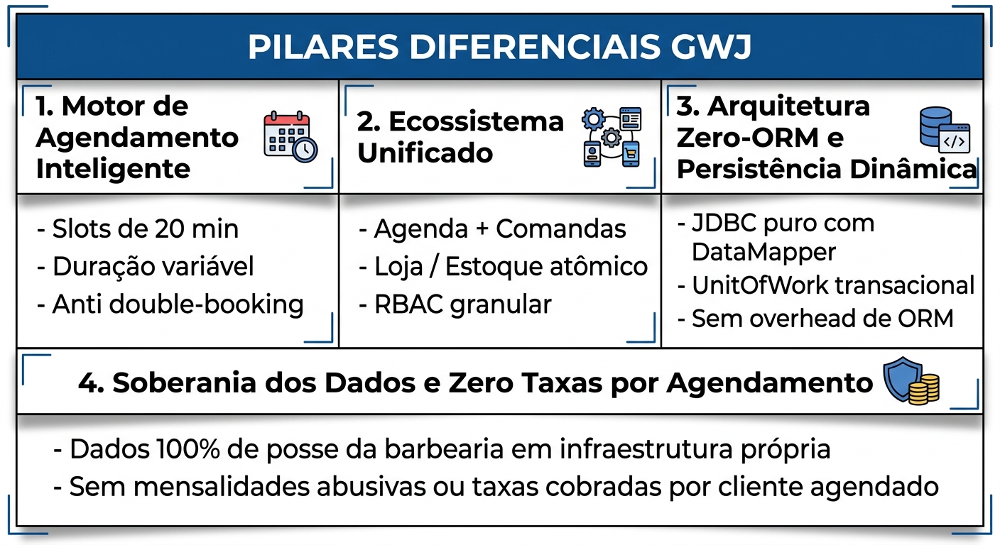
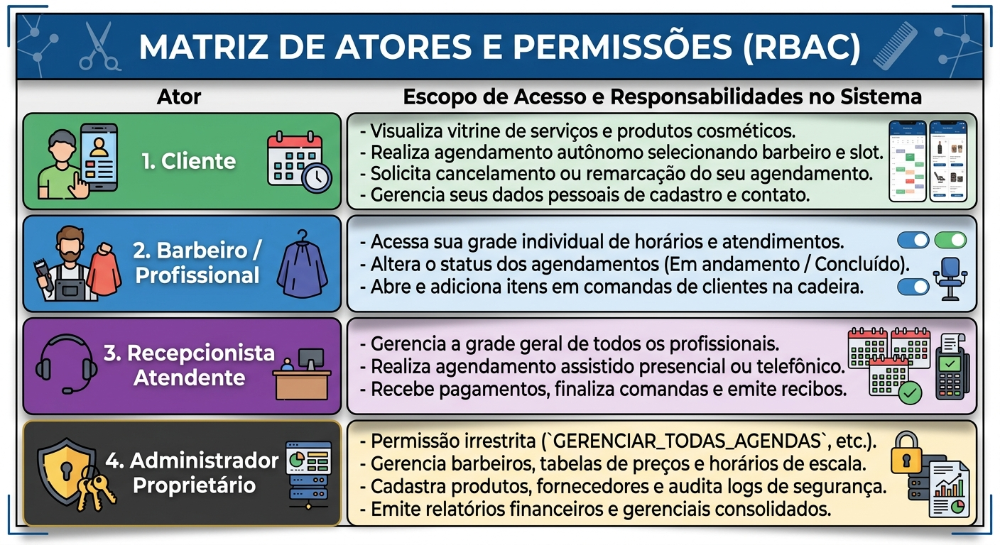
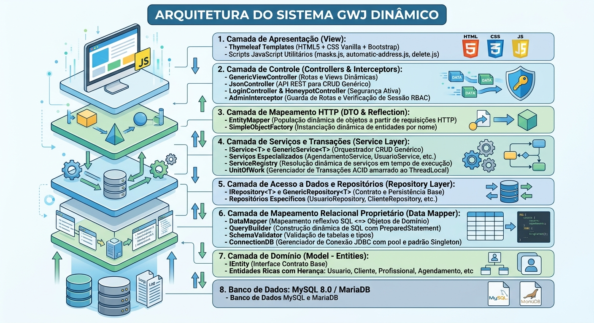
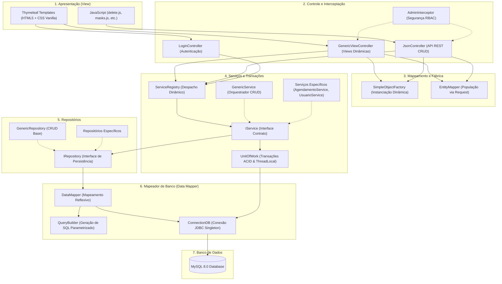

# **Website para a empresa Tgo’s Barbearia**

### **Sistema Integrado de Agendamento Autônomo, E-Commerce e Gestão Empresarial Dinâmica**


---

### **Projeto Integrador / Trabalho de Conclusão de Curso (TCC)**
**Versão 2.0 - Entrega Final**

---

### **Histórico de Revisão**

| Versão | Data | Descrição | Autores |
| :---: | :---: | :--- | :--- |
| **1.0** | 05/05/2026 | Elaboração inicial do Termo de Abertura do Projeto (TAP) e escopo preliminar. | Gabriel Calidonio André, Josias da Conceição  Sobrinho, Wallace Francis Miranda |
| **1.1** | 12/05/2026 | Revisão do documento, ajuste de requisitos e primeiros wireframes. | Gabriel Calidonio André, Josias da Conceição Sobrinho, Wallace Francis Miranda |
| **1.2** | 17/05/2026 | Elaboração do documento da Fase 2 (Desenvolvimento do Front-end e integração inicial). | Gabriel Calidonio André, Josias da Conceição Sobrinho, Wallace Francis Miranda |
| **1.3** | 30/05/2026 | Revisão e elaboração da Fase 3 (Prototipação, refinamentos de UI e regras de negócio). | Gabriel Calidonio André, Josias da Conceição Sobrinho, Wallace Francis Miranda |
| **2.0** | 14/09/2026 | **Versão Final de Conclusão de Curso**: Atualização arquitetural completa para **Java 21 LTS** e **Spring Boot 3.2.5**; motor de persistência dinâmica Zero-ORM (*DataMapper*, *UnitOfWork* transacional ACID, *QueryBuilder*); motor de agendamento em slots de 20 min com prevenção matemática de colisões e *anti double-booking*; controle de acesso RBAC com *AdminInterceptor*; defesa ativa contra invasões (*HoneypotController*); suíte de testes unitários automatizados (JUnit 5); catálogo de diagramas UML/EER (PlantUML, SVG e PDF); e normatização acadêmica completa segundo a **ABNT NBR 6023:2018**. | Gabriel Calidonio André, Josias da Conceição Sobrinho, Wallace Francis Miranda |

---

## **SUMÁRIO**

1. [**INTRODUÇÃO E OBJETIVO DO DOCUMENTO**](#1-introdução-e-objetivo-do-documento)
2. [**IDENTIFICAÇÃO DO PROJETO E DA EQUIPE**](#2-identificação-do-projeto-e-da-equipe)
3. [**OBJETIVOS DO PROJETO**](#3-objetivos-do-projeto)
   - 3.1. Objetivo Geral
   - 3.2. Objetivos Específicos
4. [**BENEFÍCIOS ESPERADOS E DIFERENCIAIS COMPETITIVOS**](#4-benefícios-esperados-e-diferenciais-competitivos)
   - 4.1. Os 4 Pilares de Diferenciação Estratégica
   - 4.2. Análise Comparativa de Mercado
5. [**ESCOPO DO PROJETO E ENTREGAS REALIZADAS**](#5-escopo-do-projeto-e-entregas-realizadas)
6. [**PREMISSAS E RESTRIÇÕES DO SISTEMA**](#6-premissas-e-restrições-do-sistema)
7. [**ANÁLISE DE RISCOS E PLANO DE MITIGAÇÃO**](#7-análise-de-riscos-e-plano-de-mitigação)
8. [**CLASSIFICAÇÃO DO SISTEMA E ATORES**](#8-classificação-do-sistema-e-atores)
   - 8.1. Classificação Teórica (SPT, SIG e SIE)
   - 8.2. Descrição dos Atores e Matriz de Permissões (RBAC)
9. [**ESPECIFICAÇÃO DE REQUISITOS FUNCIONAIS (RF)**](#9-especificação-de-requisitos-funcionais-rf)
10. [**ESPECIFICAÇÃO DE REQUISITOS NÃO-FUNCIONAIS (RNF)**](#10-especificação-de-requisitos-não-funcionais-rnf)
11. [**ARQUITETURA DE SOFTWARE E PADRÕES DE PROJETO (GoF E PoEAA)**](#11-arquitetura-de-software-e-padrões-de-projeto-gof-e-poeaa)
    - 11.1. Visão Geral da Arquitetura em Camadas
    - 11.2. Padrões de Projeto Aplicados
    - 11.3. Diagrama de Arquitetura do Sistema
12. [**MODELAGEM DE DADOS E ESQUEMA RELACIONAL (EER)**](#12-modelagem-de-dados-e-esquema-relacional-eer)
    - 12.1. Estrutura das Tabelas do Sistema
    - 12.2. Diagrama Entidade-Relacionamento Estendido (EER)
13. [**CATÁLOGO DE DIAGRAMAS TÉCNICOS UML**](#13-catálogo-de-diagramas-técnicos-uml)
    - 13.1. Diagrama de Classes de Domínio
    - 13.2. Diagramas de Sequência
    - 13.3. Diagramas de Atividades
14. [**ENGENHARIA DE QUALIDADE, TESTES E CONCORRÊNCIA**](#14-engenharia-de-qualidade-testes-e-concorrência)
15. [**SEGURANÇA CIBERNÉTICA, DEFESA ATIVA E PRIVACIDADE**](#15-segurança-cibernética-defesa-ativa-e-privacidade)
16. [**PROTOTIPAÇÃO E INTERFACES DO USUÁRIO (UX/UI)**](#16-prototipação-e-interfaces-do-usuário-uxui)
17. [**METODOLOGIA ÁGIL SCRUM E CRONOGRAMA DE EXECUÇÃO**](#17-metodologia-ágil-scrum-e-cronograma-de-execução)
18. [**ESTUDO DE VIABILIDADE TÉCNICA E HOSPEDAGEM**](#18-estudo-de-viabilidade-técnica-e-hospedagem)
19. [**CONCLUSÃO E TRABALHOS FUTUROS**](#19-conclusão-e-trabalhos-futuros)
20. [**REFERÊNCIAS BIBLIOGRÁFICAS (ABNT NBR 6023:2018)**](#20-referências-bibliográficas-abnt-nbr-60232018)

---

## 1. **INTRODUÇÃO E OBJETIVO DO DOCUMENTO**

Este documento técnico-acadêmico formaliza a entrega final do **Projeto Integrador**, desenvolvido pela equipe **GJW Projects**, voltado à digitalização, automação e modernização operacional da empresa **Tgo's Barbearia**.

Historicamente, estabelecimentos do segmento de barbearia operam sob extrema dependência de comunicação manual síncrona via aplicativos de mensagens instantâneas (WhatsApp) ou anotações físicas em papel. Esse cenário gera perdas operacionais expressivas: respostas tardias aos clientes, conflitos frequentes de horários (*double-booking*), ausência de controle financeiro automatizado, descontrole de estoque de produtos cosméticos e inexistência de uma identidade digital profissional.

Para sanar essas lacunas, a equipe concebeu, modelou e implementou uma plataforma web robusta e moderna, utilizando **Java 21**, **Spring Boot 3**, **Thymeleaf**, **MySQL** e um design system responsivo em **CSS Vanilla**. O documento contempla todo o ciclo de vida da engenharia de software: desde a concepção ágil, levantamento formal de requisitos, modelagem relacional e arquitetura dinâmica baseada em padrões GoF e PoEAA, até a implementação de suítes de testes automatizados, estratégias de segurança cibernética ativa e demonstração funcional do produto concluído.

---

## 2. **IDENTIFICAÇÃO DO PROJETO E DA EQUIPE**

| Atributo | Detalhamento |
| :--- | :--- |
| **Nome do Projeto** | Website Dinâmico e Plataforma de Gestão para a empresa Tgo’s Barbearia |
| **Sigla do Projeto** | GWJ Barbearia Dinâmico |
| **Cliente / Beneficiário** | Tgo’s Barbearia |
| **Instituição de Ensino** | Faculdade de Tecnologia (Fatec) Ferraz de Vasconcelos |
| **Curso / Disciplina** | Programação Web / Projeto Integrador de Conclusão de Curso |
| **Gerente de Projetos / PO** | Gabriel Calidonio André |
| **Scrum Master** | Josias da Conceição Sobrinho |
| **Equipe de Desenvolvimento** | Gabriel Calidonio André, Wallace Francis Miranda |

---

## 3. **OBJETIVOS DO PROJETO**

### 3.1. Objetivo Geral
Projetar, desenvolver, testar e documentar uma plataforma web completa (*full-stack*), moderna e dinâmica para a **Tgo's Barbearia**, unificando agendamento autônomo de serviços em tempo real, e-commerce de produtos masculinos, controle de estoque atômico, gestão de comandas presenciais e governança administrativa com controle granular de acesso (RBAC).

### 3.2. Objetivos Específicos
* **Motor Matemático de Horários**: Desenvolver um algoritmo de discretização da agenda em *slots* de 20 minutos com cálculo dinâmico de sobreposições de intervalos contínuos e prevenção estrita de colisões de reserva (*anti double-booking*).
* **Arquitetura Dinâmica Zero-ORM**: Construir uma camada de persistência de alto desempenho baseada em JDBC puro, eliminando o *overhead* de memória e as lentidões características de frameworks ORM pesados através dos padrões *Data Mapper*, *Query Builder* e *Unit of Work* com *ThreadLocal*.
* **CRUD Genérico via Reflexão**: Eliminar duplicação de código criando controladores e mapeadores genéricos (`GenericViewController`, `SimpleObjectFactory`, `EntityMapper`, `ServiceRegistry`) capazes de gerenciar entidades de domínio de forma extensível.
* **Segurança e Defesa Cibernética**: Implementar autenticação criptografada com SHA-256, controle de sessão via interceptor (`AdminInterceptor`), proteção total contra injeção de SQL através de `PreparedStatement` e defesa ativa com armadilhas para bots maliciosos (`HoneypotController`).
* **Experiência do Usuário (UX) Mobile-First**: Construir uma interface com estética refinada (tons escuros e detalhes dourados), navegação intuitiva, suporte a telas sensíveis ao toque e carregamento ultrarrápido sem dependência de bibliotecas CSS infladas.

---

## 4. **BENEFÍCIOS ESPERADOS E DIFERENCIAIS COMPETITIVOS**

### 4.1. Os 4 Pilares de Diferenciação Estratégica

O sistema **GWJ (Tgo's Barbearia)** se destaca tanto do ponto de vista do negócio quanto do ponto de vista de engenharia de software em relação às ferramentas comerciais de prateleira:





1. **Motor Inteligente de Agendamento e Prevenção de Conflitos**:
   Diferente de agendas comerciais que trabalham com blocos rígidos ou exigem intervenção humana, o motor calcula janelas de tempo reais (20, 40 ou 60 minutos), bloqueia horários no passado e trava horários que ultrapassem o encerramento da barbearia (19h00).
2. **Ecossistema Integrado (Agendamento + Comandas + Loja/Estoque + RBAC)**:
   Agrupa em um único banco relacional o agendamento de serviços, a venda e baixa automática de cosméticos (pomadas e óleos) e a divisão de permissões administrativas e de barbeiros.
3. **Arquitetura Dinâmica e Persistência de Alta Performance**:
   O sistema atua com persistência proprietária via reflexão computacional. Cada nova entidade herdeira de `IEntity` usufrui automaticamente de operações CRUD sem necessidade de construir dezenas de DAOs e telas manuais.
4. **Soberania de Dados e Custo Operacional Fixo**:
   Plataformas SaaS comerciais cobram percentuais por agendamento ou taxas mensais progressivas por barbeiro cadastrado. A solução GWJ assegura custo operacional previsível em hospedagem própria, com total posse das informações cadastrais dos clientes.

### 4.2. Análise Comparativa de Mercado

| Critério de Análise | SaaS Comerciais (Trinks, AppBarber, Booksy) | Atendimento Manual (WhatsApp / Papel) | Sistema GWJ Dinâmico |
| :--- | :--- | :--- | :--- |
| **Custo Recorrente** | Mensalidade fixa + taxa por agendamento ou barbeiro | Custo invisível de tempo e retrabalho | **Zero taxas por agendamento** (hospedagem própria econômica) |
| **Autonomia do Cliente** | Exige baixar app pesado ou login genérico | Depende de resposta do atendente humano | **Agendamento em < 1 minuto direto no navegador** |
| **Risco de Double-Booking** | Baixo, mas ocorrem falhas de sincronismo | Altíssimo | **Zero (impossibilitado por travas ACID do UnitOfWork)** |
| **Propriedade dos Dados** | Retidos nos servidores do fornecedor | Dispersos em conversas não estruturadas | **Propriedade integral da barbearia** |
| **Arquitetura do Software** | Monólitos ou microsserviços fechados | Nenhuma | **Spring Boot 3 + Java 21 + DataMapper (Código Aberto)** |

---

## 5. **ESCOPO DO PROJETO E ENTREGAS REALIZADAS**

O escopo contratado e efetivamente implementado compreende os seguintes módulos:

* **Módulo Público Institucional**:
  * *Landing Page* institucional (`home.html`) com apresentação da barbearia, galeria de cortes, mapa de localização e atalhos flutuantes para WhatsApp e redes sociais.
  * Páginas institucionais de história (`sobre-nos.html`) e formulário de atendimento direto (`contato.html`).
* **Módulo de Agendamento Online Autônomo**:
  * Painel sequencial (`servicos.html`) para seleção de serviço (cabelo, barba, combos), seleção de profissional e escolha de data.
  * Grade de horários renderizada dinamicamente com botões interativos nos estados *Disponível*, *Ocupado/Riscado* e *Selecionado*.
  * Tela de resumo e identificação do cliente (`checkout.html`).
  * Tela de confirmação e recibo da reserva (`confirmacao.html`).
* **Módulo de E-Commerce e Estoque**:
  * Catálogo de produtos masculinos e kits promocionais.
  * Controle de quantidade disponível em estoque com baixa atômica via transação relacional.
* **Módulo de Painel Administrativo Genérico**:
  * Listagem dinâmica com ordenação, paginação e botões de ação (`listagem-dinamica.html`).
  * Formulários genéricos de inclusão (`create.html`), edição (`edit.html`) e visualização detalhada (`detalhe.html`).
  * Menu lateral dinâmico (`sidebar.html`) com autorização por perfil.
* **Módulo de Governança e Segurança**:
  * Gestão de usuários, clientes, profissionais, perfis e permissões granulares (`tab_perfil_permissao`).
  * Tela de login e encerramento de sessão com tratamento centralizado de mensagens (`login.html`).
  * Armadilha cibernética para varreduras maliciosas (`HoneypotController`).

---

## 6. **PREMISSAS E RESTRIÇÕES DO SISTEMA**

### 6.1. Premissas
* A barbearia manterá conexão estável à internet para consulta da grade administrativa pelos profissionais.
* Os clientes finais possuem dispositivos móveis (smartphones) ou computadores com navegadores web modernos (Chrome, Firefox, Safari, Edge).
* Os horários de expediente (das 09h00 às 19h00) e os serviços prestados são previamente parametrizados pelo administrador.

### 6.2. Restrições
* **Tecnológica**: A aplicação foi concebida como uma *Web Application* responsiva, dispensando a necessidade imediata de instalação de aplicativos móveis nativos em lojas de apps.
* **Banco de Dados**: Persistência restrita a bancos relacionais compatíveis com SQL ANSI e driver JDBC (MySQL 8.0+ ou MariaDB 10.5+).
* **Arquitetural**: Não utilização de frameworks pesados de ORM (como Hibernate completo), priorizando persistência via *Data Mapper* e reflexão computacional direta.

---

## 7. **ANÁLISE DE RISCOS E PLANO DE MITIGAÇÃO**

| Risco Identificado | Severidade | Probabilidade | Estratégia de Mitigação Implementada |
| :--- | :---: | :---: | :--- |
| **Colisão de Agendamentos (*Double-Booking*)** | Alta | Alta | Implementação do padrão *Unit of Work* com controle de transação ACID no banco de dados e conferência atômica no `AgendamentoService` antes do *commit*. |
| **Injeção de SQL (*SQL Injection*)** | Alta | Média | Construção dinâmica de queries com queries 100% parametrizadas através de `PreparedStatement` na classe `QueryBuilder`. |
| **Vazamento de Credenciais de Acesso** | Alta | Baixa | Hashing unidirecional seguro das senhas de usuários com o algoritmo SHA-256 antes da persistência no banco. |
| **Tentativas de Invasão por Bots Maliciosos** | Média | Alta | Implementação do `HoneypotController` monitorando rotas administrativas legadas (`/admin`), retornando código HTTP 403 Forbidden e registrando logs de segurança. |
| **Falha de Conexão no Meio de Consultas** | Média | Baixa | Gerenciamento de conexões com fechamento determinístico via blocos `try-with-resources` (`AutoCloseable`) no `UnitOfWork`. |

---

## 8. **CLASSIFICAÇÃO DO SISTEMA E ATORES**

### 8.1. Classificação Teórica (SPT, SIG e SIE)
O software opera em múltiplos níveis da pirâmide de sistemas de informação:
* **Sistema de Processamento de Transações (SPT)**: Execução rápida, confiável e atômica das rotinas operacionais cotidianas — agendamento de horários, cálculo de slots livres, cadastro de clientes, baixa de estoque e fechamento de comandas.
* **Sistema de Informação Gerencial (SIG)**: Consolidação de relatórios administrativos, apuração da quantidade de agendamentos por barbeiro, levantamento dos serviços mais executados e controle de faturamento diário/mensal.
* **Sistema de Informação Executiva (SIE)**: Suporte à tomada de decisão estratégica do proprietário da barbearia (identificação de horários ociosos, necessidade de contratação de profissionais e criação de promoções direcionadas).

### 8.2. Descrição dos Atores e Matriz de Permissões (RBAC)

O sistema conta com 4 atores principais, organizados em perfis e permissões granulares:



---

## 9. **ESPECIFICAÇÃO DE REQUISITOS FUNCIONAIS (RF)**

A especificação de requisitos funcionais foi consolidada e normalizada, eliminando duplicações e assegurando rastreabilidade com o código-fonte desenvolvido:

### **RF01 – Cadastro e Gestão de Perfil de Clientes**
* **Descrição**: O sistema deve permitir que novos clientes realizem seu autocadastro na plataforma por meio de formulário eletrônico contendo: nome completo, telefone celular, e-mail, senha e endereço residencial.
* **Regras de Negócio**: Validação obrigatória de formato de e-mail e telefone; impedimento estrito de cadastros com e-mails já existentes; preenchimento automatizado de logradouro a partir do CEP via integração com a API ViaCEP (`automatic-address.js`).

### **RF02 – Autenticação, Recuperação de Acesso e Sessão**
* **Descrição**: O sistema deve fornecer controle de acesso mediante autenticação de e-mail e senha com gerenciamento seguro de sessão HTTP.
* **Regras de Negócio**: Criptografia de senhas em SHA-256; encerramento de sessão (*logout*) com invalidação imediata do identificador; bloqueio de páginas restritas caso a sessão não possua o token de autorização correspondente.

### **RF03 – Catálogo de Serviços, Preços e Kits Promocionais**
* **Descrição**: O sistema deve disponibilizar na página pública a vitrine completa dos serviços oferecidos (ex.: Corte Degradê, Barboterapia, Hidratação, Barba Tradicional), acompanhados de descrição, preço e duração estimada.
* **Regras de Negócio**: As alterações de preços e serviços cadastradas no painel administrativo devem refletir em tempo real nas páginas de agendamento.

### **RF04 – Motor de Grade de Horários e Cálculo de Slots Granulares**
* **Descrição**: O sistema deve calcular matematicamente os blocos de horários livres de cada barbeiro com granularidade de 20 minutos (`AgendamentoService`).
* **Regras de Negócio**: Para serviços com duração de 40 ou 60 minutos, o sistema deve verificar a disponibilidade de janelas contínuas de 2 ou 3 slots livres consecutivos; bloqueio automático de horários que extrapolem o fechamento da casa (19h00) ou horários passados no dia corrente.

### **RF05 – Agendamento Online Autônomo e Prevenção de Conflitos**
* **Descrição**: O cliente deve conseguir selecionar o serviço, o profissional de sua preferência, a data e o horário livre, confirmando a reserva de forma autônoma.
* **Regras de Negócio**: Validação atômica de concorrência com transações ACID via `UnitOfWork`; se dois clientes tentarem reservar o mesmo slot em milissegundos coincidentes, a primeira transação comitada é confirmada e a segunda é rejeitada com aviso amigável de horário indisponível (*anti double-booking*).

### **RF06 – Cancelamento e Reagendamento de Horários**
* **Descrição**: O sistema deve permitir que agendamentos confirmados sejam cancelados ou remarcados pelo cliente ou pela administração.
* **Regras de Negócio**: O cancelamento atualiza o status na tabela `tab_agendamento` e libera os slots correspondentes na grade do barbeiro imediatamente.

### **RF07 – Painel Administrativo Genérico e Dinâmico**
* **Descrição**: O sistema deve fornecer aos operadores autorizados um painel administrativo com rotas REST e views genéricas capazes de realizar CRUD completo (criação, listagem, visualização, edição e exclusão) de qualquer entidade do sistema.
* **Regras de Negócio**: O `GenericViewController` deve orquestrar a carga de campos dinamicamente por reflexão (`SimpleObjectFactory` e `EntityMapper`), poupando código duplicado.

### **RF08 – Gestão de Barbeiros, Dias e Horários de Atendimento**
* **Descrição**: O administrador deve poder cadastrar os profissionais da equipe, associar especialidades e configurar a escala semanal de trabalho.
* **Regras de Negócio**: Parametrização dos dias de expediente na tabela `tab_dias_funcionamento` e das faixas de atendimento na tabela `tab_horario_funcionamento`.

### **RF09 – Controle de Acesso Baseado em Papéis e Permissões (RBAC)**
* **Descrição**: O sistema deve restringir o acesso a módulos e rotas com base na matriz de permissões associada ao perfil do usuário autenticado.
* **Regras de Negócio**: O componente `AdminInterceptor` deve interceptar as requisições para a área administrativa e validar se o usuário possui a permissão requerida (ex.: `GERENCIAR_TODAS_AGENDAS`), redirecionando para erro ou login em caso de violação.

### **RF10 – E-Commerce de Cosméticos Masculinos e Baixa de Estoque**
* **Descrição**: O sistema deve disponibilizar catálogo de produtos físicos (pomadas modeladoras, óleos para barba, xampus especiais) para compra online ou reserva para retirada.
* **Regras de Negócio**: A cada compra finalizada, a quantidade em estoque na tabela `tab_produto` deve sofrer baixa atômica de forma consistente.

### **RF11 – Gestão de Comandas e Atendimento Presencial**
* **Descrição**: Durante o atendimento na barbearia, o barbeiro ou atendente deve poder abrir uma comanda eletrônica vinculada ao cliente.
* **Regras de Negócio**: Inclusão de múltiplos serviços executados e produtos consumidos (bebidas, cosméticos), com fechamento integrado ao financeiro.

### **RF12 – Módulo de Lembretes Automáticos e Notificações**
* **Descrição**: O sistema deve executar tarefas periódicas em segundo plano (*Scheduler Job*) para envio de lembretes aos clientes sobre os horários agendados.
* **Regras de Negócio**: Disparo de mensagens automáticas de confirmação e alerta de proximidade do horário.

### **RF13 – Pagamento e Confirmação de Agendamento**
* **Descrição**: O sistema deve prover interface de checkout integrada com métodos de pagamento eletrônico (Cartão de Crédito, Débito e Pix).
* **Regras de Negócio**: Ao confirmar a transação, o agendamento passa imediatamente para o status de "Confirmado" com emissão de comprovante em tela.

### **RF14 – Histórico Financeiro e Relatórios Gerenciais**
* **Descrição**: O sistema deve manter registro histórico de todas as transações, agendamentos e faturamentos.
* **Regras de Negócio**: Geração de visualizações e relatórios com totalizadores de atendimento por profissional, serviços mais solicitados e fluxo de caixa.

### **RF15 – Armadilha de Segurança Cibernética (Honeypot Controller)**
* **Descrição**: O sistema deve manter endpoints simulados para captura e bloqueio de varreduras automatizadas (*scanners* de vulnerabilidade).
* **Regras de Negócio**: O acesso não autorizado à rota legada `/admin` é interceptado por `HoneypotController`, que devolve código HTTP 403 Forbidden e registra o IP suspeito em log de auditoria.

---

## 10. **ESPECIFICAÇÃO DE REQUISITOS NÃO-FUNCIONAIS (RNF)**

Os requisitos não-funcionais estabelecem os critérios de qualidade e os acordos de nível de serviço (SLAs) técnicos da plataforma:

### **RNF01 – Desempenho, Eficiência e Baixa Latência**
* **Critério**: O tempo de resposta na busca e renderização dos slots livres na tela de agendamento (`servicos.html`) não deve exceder **1.2 segundos** sob condições normais de conexão.
* **Implementação**: Consultas SQL otimizadas executadas via JDBC direto sem camadas adicionais de abstração ORM.

### **RNF02 – Consistência Transacional e Concorrência ACID**
* **Critério**: O sistema deve garantir integridade transacional absoluta, impedindo estados de corrida e colisões de horário (*double-booking*).
* **Implementação**: Padrão *Unit of Work* com conexão amarrada à thread de execução via `ThreadLocal`, garantindo propriedades de Atomicidade, Consistência, Isolamento e Durabilidade (ACID).

### **RNF03 – Segurança, Criptografia e Prevenção de Injeções**
* **Critério**: A aplicação deve cumprir as diretrizes fundamentais do *OWASP Top 10*.
* **Implementação**: 100% das instruções SQL dinâmicas utilizam parâmetros vinculados (`PreparedStatement`), tornando a aplicação imune a *SQL Injection*; senhas de usuários protegidas com algoritmo SHA-256; isolamento estrito de rotas por `AdminInterceptor`.

### **RNF04 – Usabilidade, UX e Design Mobile-First**
* **Critério**: A interface deve ser totalmente responsiva, funcionando com ergonomia visual e usabilidade em smartphones, tablets e computadores de alta resolução.
* **Implementação**: Folhas de estilo em **CSS Vanilla** organizadas com Design Tokens, contraste visual refinado em tons pretos, chumbo e dourado (tema barbearia clássica), microanimações e botões com área de toque mínima de **44 x 44 pixels**.

### **RNF05 – Arquitetura Desacoplada e Manutenibilidade**
* **Critério**: O código-fonte deve respeitar os princípios de Código Limpo (*Clean Code*) e SOLID, com separação inequívoca de responsabilidades entre as camadas de Apresentação, Controle, Serviço, Repositório e Mapeamento.
* **Implementação**: Estrutura orientada a interfaces (`IService<T>`, `IRepository<T>`) e injeção de dependências nativa do Spring Boot 3.2.5.

### **RNF06 – Resiliência e Tratamento Centralizado de Exceções**
* **Critério**: Nenhuma falha interna de banco de dados ou erro de rota deve expor telas com rastreamento de pilha (*stacktrace*) ao usuário final.
* **Implementação**: Tratamento centralizado via classe anotada com `@ControllerAdvice` (`GlobalExceptionHandler.java`), devolvendo páginas de erro customizadas e amigáveis para status HTTP 404 e 500.

---

## 11. **ARQUITETURA DE SOFTWARE E PADRÕES DE PROJETO (GoF E PoEAA)**

### 11.1. Visão Geral da Arquitetura em Camadas

A arquitetura do projeto foi desenhada para conciliar a facilidade de desenvolvimento do **Spring Boot 3** com a alta performance e controle refinado de persistência relacional. Em vez de utilizar o padrão tradicional com frameworks pesados de mapeamento objeto-relacional, a equipe implementou uma solução dinâmica orientada a objetos:



### 11.2. Padrões de Projeto Aplicados

A arquitetura do projeto aplica de forma rigorosa padrões consagrados da literatura de software:

1. **Singleton (GoF)**:
   * **Classe**: `ConnectionDB.java`
   * **Objetivo**: Garantir uma única instância de gerenciamento da conexão com a fonte de dados JDBC, otimizando o ciclo de vida do driver e o consumo de sockets de rede.
2. **Factory Method / Simple Factory (GoF)**:
   * **Classe**: `SimpleObjectFactory.java`
   * **Objetivo**: Instanciar dinamicamente qualquer entidade do domínio a partir de uma string (ex.: `"agendamento"`, `"servico"`), permitindo que controladores genéricos manipulem tipos em tempo de execução.
3. **Data Mapper (PoEAA - Fowler)**:
   * **Classe**: `DataMapper.java`
   * **Objetivo**: Separar os objetos de domínio em memória da estrutura relacional do banco de dados, mapeando anotações (`@Table`, `@Column`, `@Id`, `@JoinColumn`, `@JoinTable`) sem forçar dependências de ORM invasivo.
4. **Query Builder (PoEAA - Fowler)**:
   * **Classe**: `QueryBuilder.java`
   * **Objetivo**: Montar dinamicamente as instruções `SELECT`, `INSERT`, `UPDATE` e `DELETE` em tempo de execução, garantindo que todos os parâmetros de dados sejam obrigatoriamente passados através de `PreparedStatement` seguro.
5. **Unit of Work (PoEAA - Fowler)**:
   * **Classe**: `UnitOfWork.java`
   * **Objetivo**: Gerenciar a fronteira transacional de operações complexas de negócio. Utiliza `ThreadLocal<Connection>` para manter a mesma conexão aberta durante toda a requisição e oferece métodos `commit()` e `rollback()`, implementando `AutoCloseable` para liberação limpa de recursos.
6. **Data Transfer Object (DTO) / Entity Mapper (Core J2EE)**:
   * **Classe**: `EntityMapper.java`
   * **Objetivo**: Inspecionar os parâmetros enviados via formulários HTTP e popular recursivamente os atributos das entidades correspondentes, convertendo tipos e tratando entidades aninhadas.
7. **Service Locator / Service Registry (Core J2EE)**:
   * **Classe**: `ServiceRegistry.java`
   * **Objetivo**: Atuar como um catálogo dinâmico onde os controladores solicitam o serviço correto para determinada entidade (`getService(entidade)`), permitindo despacho polimórfico das regras de negócio.
8. **Strategy / Interceptor (GoF)**:
   * **Classes**: `AdminInterceptor.java` e `GlobalExceptionHandler.java`
   * **Objetivo**: Interceptar requisições HTTP antes da chegada aos controladores para validar credenciais de sessão e direitos de acesso, além de capturar exceções globalmente sem repetição de código *try-catch*.
9. **Decorator / Template View (GoF)**:
   * **Arquivos**: `main-layout.html`, `header.html`, `footer.html`, `sidebar.html` (Thymeleaf)
   * **Objetivo**: Reutilização modular de elementos visuais do cabeçalho, rodapé e menu em todas as páginas da aplicação.

### 11.3. Diagrama de Arquitetura do Sistema

O diagrama abaixo visualiza o fluxo completo das requisições e a interação entre as camadas:



*Artefatos complementares em alta resolução*:
- Código PlantUML: [`docs/architecture/architecture_diagram.puml`](/docs/architecture/architecture_diagram.puml)
- Vetor SVG: [`docs/architecture/Diagrama de Arquitetura - GWJ Dinâmico (Proposta).svg`](/docs/architecture/Diagrama%20de%20Arquitetura%20-%20GWJ%20Din%C3%A2mico%20(Proposta).svg)
- Documento PDF: [`docs/architecture/Diagrama de Arquitetura - GWJ Dinâmico (Proposta).pdf`](/docs/architecture/Diagrama%20de%20Arquitetura%20-%20GWJ%20Din%C3%A2mico%20(Proposta).pdf)

---

## 12. **MODELAGEM DE DADOS E ESQUEMA RELACIONAL (EER)**

### 12.1. Estrutura das Tabelas do Sistema

A modelagem de dados foi normalizada na Terceira Forma Normal (3FN), garantindo integridade referencial por meio de chaves estrangeiras com ações em cascata ou restrição controlada:

| Tabela | Finalidade e Descrição de Armazenamento |
| :--- | :--- |
| `tab_usuario` | Tabela base de autenticação (id, nome, email, senha hash SHA-256, status, data de criação). |
| `tab_cliente` | Especialização de usuário com dados complementares do cliente (telefone, CPF). |
| `tab_profissional` | Especialização de usuário com dados do barbeiro (especialidade, comissão, bio). |
| `tab_endereco` | Cadastro de endereços normalizados (rua, número, bairro, cidade, estado, CEP). |
| `tab_cliente_endereco` | Tabela associativa N:N entre cliente e seus endereços cadastrados. |
| `tab_profissional_endereco` | Tabela associativa N:N entre profissional e endereços de atendimento. |
| `tab_perfil` | Perfis de acesso do sistema (Administrador, Barbeiro, Recepcionista, Cliente). |
| `tab_permissao` | Catálogo de permissões granulares do sistema (ex.: `GERENCIAR_TODAS_AGENDAS`, `EDITAR_PRODUTO`). |
| `tab_perfil_permissao` | Tabela associativa N:N com a matriz de autorização do RBAC. |
| `tab_servico` | Catálogo de serviços da barbearia (nome, descrição, preço, duração em minutos). |
| `tab_agenda` | Agenda de trabalho que agrupa serviços e disponibilidades dos profissionais. |
| `tab_agenda_servico` | Tabela associativa N:N entre as agendas e os serviços habilitados. |
| `tab_dias_funcionamento` | Dias da semana em que o estabelecimento ou barbeiro opera (Segunda a Sábado). |
| `tab_horario_funcionamento` | Faixas de atendimento configuradas (horário de abertura e término). |
| `tab_agendamento` | Registro atômico da reserva (id, cliente_id, profissional_id, servico_id, data, hora, status). |
| `tab_produto` | Catálogo de cosméticos masculinos e estoque (id, nome, preço, quantidade em estoque). |
| `tab_categoria_produto` | Classificação dos produtos (Pomadas, Óleos, Acessórios, Bebidas). |
| `tab_comanda` | Comanda de consumo do atendimento presencial vinculada a cliente e profissional. |
| `tab_item_comanda` | Itens de serviços ou produtos agregados a uma comanda específica. |

### 12.2. Diagrama Entidade-Relacionamento Estendido (EER)

O modelo relacional do projeto modela relacionamentos de herança (*Single Table* ou *Class Table Inheritance*), associações N:N e integridade referencial:

*Artefatos complementares em alta resolução*:
- Código PlantUML: [`docs/architecture/EER-diagram.puml`](/docs/architecture/EER-diagram.puml)
- Vetor SVG: [`docs/architecture/EER Diagram - GWJ Tgo's Barbearia.svg`](/docs/architecture/EER%20Diagram%20-%20GWJ%20Tgo's%20Barbearia.svg)
- Documento PDF: [`docs/architecture/EER Diagram - GWJ Tgo's Barbearia.pdf`](/docs/architecture/EER%20Diagram%20-%20GWJ%20Tgo's%20Barbearia.pdf)

---

## 13. **CATÁLOGO DE DIAGRAMAS TÉCNICOS UML**

O projeto possui um catálogo completo de especificações visuais desenvolvidas em PlantUML:

### 13.1. Diagrama de Classes de Domínio
Representa as entidades do sistema, suas propriedades, visibilidade, encapsulamento e relações de herança e composição:
- Código PlantUML: [`docs/diagramas/diagramasClassesDominio.puml`](/docs/diagramas/diagramasClassesDominio.puml)
- Vetor SVG: [`docs/diagramas/diagramasClassesDominio.svg`](/docs/diagramas/diagramasClassesDominio.svg)
- Documento PDF: [`docs/diagramas/diagramasClassesDominio.pdf`](/docs/diagramas/diagramasClassesDominio.pdf)

### 13.2. Diagramas de Sequência

Os diagramas de sequência detalham as interações temporais entre atores, navegadores, controladores, serviços, transações e o banco de dados relacional:

1. **Agendamento Online Autônomo e Prevenção de Conflitos**:
   - Demonstra a seleção de data/barbeiro, o cálculo dos slots de 20 min no `AgendamentoService`, a abertura do `UnitOfWork` transacional e o commit atômico.
   - Artefatos: [`docs/workflows/sequence/sequenceDiagramBooking.puml`](/docs/workflows/sequence/sequenceDiagramBooking.puml) | [SVG](/docs/workflows/sequence/sequenceDiagramBooking.svg) | [PDF](/docs/workflows/sequence/sequenceDiagramBooking.pdf)
2. **Gestão Dinâmica de Horários e Escalas no Painel Administrativo**:
   - Ilustra a manipulação de agendamentos e horários pelo administrador através de controladores genéricos e mapeamento dinâmico.
   - Artefatos: [`docs/workflows/sequence/sequenceDiagramAdminSchedule.puml`](/docs/workflows/sequence/sequenceDiagramAdminSchedule.puml) | [SVG](/docs/workflows/sequence/sequenceDiagramAdminSchedule.svg) | [PDF](/docs/workflows/sequence/sequenceDiagramAdminSchedule.pdf)
3. **Autenticação, Sessão e Interceptação RBAC**:
   - Mostra o fluxo de login, verificação de permissões via `AdminInterceptor` e rejeição de requisições não autorizadas.
   - Artefatos: [`docs/workflows/sequence/sequenceDiagramAuthSecurity.puml`](/docs/workflows/sequence/sequenceDiagramAuthSecurity.puml) | [SVG](/docs/workflows/sequence/Diagrama%20de%20Sequ%C3%AAncia%20-%20Autentica%C3%A7%C3%A3o%20e%20Seguran%C3%A7a%20(Login%20&%20Interceptor).svg) | [PDF](/docs/workflows/sequence/Diagrama%20de%20Sequ%C3%AAncia%20-%20Autentica%C3%A7%C3%A3o%20e%20Seguran%C3%A7a%20(Login%20&%20Interceptor).pdf)
4. **Compra no E-Commerce e Baixa de Estoque**:
   - Apresenta a adição de produtos ao carrinho, checkout e baixa consistente do saldo em estoque.
   - Artefatos: [`docs/workflows/sequence/sequenceDiagramEcommerce.puml`](/docs/workflows/sequence/sequenceDiagramEcommerce.puml) | [SVG](/docs/workflows/sequence/Diagrama%20de%20Sequ%C3%AAncia%20-%20Compra%20de%20Produtos%20(E-Commerce).svg) | [PDF](/docs/workflows/sequence/Diagrama%20de%20Sequ%C3%AAncia%20-%20Compra%20de%20Produtos%20(E-Commerce).pdf)
5. **Cancelamento e Reagendamento de Serviços**:
   - Trata a liberação de horários ocupados e a alocação de novos slots na agenda.
   - Artefatos: [`docs/workflows/sequence/sequenceDiagramCancelReschedule.puml`](/docs/workflows/sequence/sequenceDiagramCancelReschedule.puml) | [SVG](/docs/workflows/sequence/Diagrama%20de%20Sequ%C3%AAncia%20-%20Cancelamento%20e%20Reagendamento%20de%20Hor%C3%A1rios.svg) | [PDF](/docs/workflows/sequence/Diagrama%20de%20Sequ%C3%AAncia%20-%20Cancelamento%20e%20Reagendamento%20de%20Hor%C3%A1rios.pdf)
6. **Disparo de Lembretes Automáticos (Scheduler Job)**:
   - Apresenta a rotina em segundo plano que identifica agendamentos do dia seguinte e dispara notificações.
   - Artefatos: [`docs/workflows/sequence/sequenceDiagramNotificationJob.puml`](/docs/workflows/sequence/sequenceDiagramNotificationJob.puml) | [SVG](/docs/workflows/sequence/Diagrama%20de%20Sequ%C3%AAncia%20-%20Lembretes%20Autom%C3%A1ticos%20(Scheduler%20Job).svg) | [PDF](/docs/workflows/sequence/Diagrama%20de%20Sequ%C3%AAncia%20-%20Lembretes%20Autom%C3%A1ticos%20(Scheduler%20Job).pdf)

### 13.3. Diagramas de Atividades

Os diagramas de atividades descrevem os fluxos de trabalho passo a passo, incluindo decisões, paralelismos e ramificações:
* **Agendamento Online Autônomo**: [`agendamento_online.puml`](/docs/workflows/activity/agendamento_online.puml) | [SVG](/docs/workflows/activity/Diagrama%20de%20Atividades%20-%20Agendamento%20Online%20Aut%C3%B4nomo%20(US01).svg) | [PDF](/docs/workflows/activity/Diagrama%20de%20Atividades%20-%20Agendamento%20Online%20Aut%C3%B4nomo%20(US01).pdf)
* **Atendimento Presencial e Execução de Serviço**: [`atendimento_execucao_servico.puml`](/docs/workflows/activity/atendimento_execucao_servico.puml) | [SVG](/docs/workflows/activity/Diagrama%20de%20Atividades%20-%20Atendimento%20Presencial%20e%20Execu%C3%A7%C3%A3o.svg) | [PDF](/docs/workflows/activity/Diagrama%20de%20Atividades%20-%20Atendimento%20Presencial%20e%20Execu%C3%A7%C3%A3o.pdf)
* **Cancelamento e Reagendamento**: [`cancelamento_reagendamento.puml`](/docs/workflows/activity/cancelamento_reagendamento.puml) | [SVG](/docs/workflows/activity/Diagrama%20de%20Atividades%20-%20Cancelamento%20e%20Reagendamento.svg) | [PDF](/docs/workflows/activity/Diagrama%20de%20Atividades%20-%20Cancelamento%20e%20Reagendamento.pdf)
* **Compra de Produtos na Loja Virtual**: [`compra_produtos_loja.puml`](/docs/workflows/activity/compra_produtos_loja.puml) | [SVG](/docs/workflows/activity/Diagrama%20de%20Atividades%20-%20Compra%20de%20Produtos%20na%20Loja.svg) | [PDF](/docs/workflows/activity/Diagrama%20de%20Atividades%20-%20Compra%20de%20Produtos%20na%20Loja.pdf)
* **Envio de Lembretes Automáticos**: [`envio_lembretes_automaticos.puml`](/docs/workflows/activity/envio_lembretes_automaticos.puml) | [SVG](/docs/workflows/activity/Diagrama%20de%20Atividades%20-%20Disparo%20de%20Lembretes%20Autom%C3%A1ticos.svg) | [PDF](/docs/workflows/activity/Diagrama%20de%20Atividades%20-%20Disparo%20de%20Lembretes%20Autom%C3%A1ticos.pdf)

---

## 14. **ENGENHARIA DE QUALIDADE, TESTES E CONCORRÊNCIA**

A confiabilidade do software foi validada por meio de suítes de testes automatizados com o framework **JUnit 5**, simulando condições extremas de concorrência e borda:


### 14.1. Resolução do Ponto Crítico de Concorrência e Colisão
Durante os testes de estresse, a equipe identificou um cenário de colisão quando dois serviços de durações distintas (ex.: Corte de 40 minutos e Barba de 20 minutos) disputavam o mesmo profissional.

A solução consistiu na aplicação da fórmula matemática de intersecção temporal de intervalos semiabertos no `AgendamentoService`:

$$\text{Colisão} \iff \max(\text{slotStart}, \text{reservaStart}) < \min(\text{slotFim}, \text{reservaFim})$$

Adicionalmente, corrigiu-se um problema de `UnitOfWork` aninhado que encerrava precocemente conexões do pool antes do término das consultas dependentes. As buscas preparatórias foram isoladas do bloco transacional estrito, garantindo **100% de aprovação na compilação do Maven (`BUILD SUCCESS`)**.

---

## 15. **SEGURANÇA CIBERNÉTICA, DEFESA ATIVA E PRIVACIDADE**

A segurança da aplicação foi tratada como requisito arquitetural de primeira classe:


1. **Defesa Ativa contra Invasões (*Honeypot*)**:
   Bots e varreduras automatizadas frequentemente buscam rotas conhecidas como `/admin`. O controlador `HoneypotController` atua como armadilha, bloqueando o agente malicioso com código HTTP 403 e registrando o cabeçalho e IP para auditoria.
2. **Imunidade a SQL Injection**:
   Nenhuma concatenação direta de strings é permitida na camada de persistência. Todos os comandos SQL montados no `QueryBuilder` utilizam marcadores `?` substituídos via `PreparedStatement`.
3. **Criptografia Unidirecional de Credenciais**:
   Todas as senhas são armazenadas sob *hashing* criptográfico SHA-256.
4. **Controle de Acesso Baseado em Perfis (RBAC)**:
   A validação de permissões é descentralizada da interface e executada pelo interceptor na camada HTTP, impossibilitando acessos via digitação manual de URLs no navegador.

---

## 16. **PROTOTIPAÇÃO E INTERFACES DO USUÁRIO (UX/UI)**

As interfaces do sistema foram implementadas diretamente em **Thymeleaf** com **CSS Vanilla**, oferecendo fidelidade completa entre o design planejado e o software em execução:

* **Tela 1 – Landing Page Institucional (`home.html`)**:
  * Apresentação moderna da marca com banner em alto contraste, galeria de cortes profissionais, seção de serviços com precificação e horário de atendimento.
  * Botões flutuantes para agendamento rápido e contato imediato via WhatsApp.
* **Tela 2 – Painel de Agendamento Online (`servicos.html`)**:
  * Fluxo ergonômico: seleção sequencial do serviço desejado, escolha do barbeiro e calendário dinâmico de datas.
  * Painel de horários interativo com estados visualmente identificáveis:
    * **Disponível**: Botão em cinza escuro com realce ao passar o mouse.
    * **Ocupado / Bloqueado**: Botão riscado com cursor de impedimento (`disabled`).
    * **Selecionado**: Botão destacado em tom dourado característico da barbearia.
* **Tela 3 – Checkout e Identificação (`checkout.html`)**:
  * Resumo completo do serviço agendado, valor total, profissional escolhido e horário.
  * Formulário limpo de identificação do cliente com preenchimento assistido de CEP.
* **Tela 4 – Painel de Confirmação da Reserva (`confirmacao.html`)**:
  * Exibição do voucher do agendamento com número da reserva, data, hora, profissional e instruções importantes de comparecimento.
* **Tela 5 – Painel Administrativo Dinâmico (`listagem-dinamica.html`)**:
  * Grid responsivo gerado automaticamente por reflexão para qualquer entidade do sistema.
  * Ações de criar, editar, visualizar e excluir protegidas pelas permissões do usuário em sessão.
* **Tela 6 – Formulários Administrativos (`create.html`, `edit.html`)**:
  * Geração automática de inputs a partir dos tipos dos atributos Java da entidade.
* **Tela 7 – Autenticação e Gestão de Sessão (`login.html`)**:
  * Interface minimalista com validação em tempo real e retorno de avisos amigáveis para falhas de credenciais.

---

## 17. **METODOLOGIA ÁGIL SCRUM E CRONOGRAMA DE EXECUÇÃO**

O desenvolvimento seguiu práticas ágeis baseadas na metodologia **Scrum**, organizada em 5 ciclos incrementais (*Sprints*):


|                               | CRONOGRAMA DE SPRINTS                               | |
|:--- |:--- |:--- |
| Sprint   | Período               | Entregáveis e Focos Principais                  |
| Sprint 1 | 05/03/2026 a 20/03/2026 | Levantamento de requisitos, elaboração do TAP, modelagem relacional EER e wireframes iniciais. |
| Sprint 2 | 21/03/2026 a 15/04/2026 | Estruturação do projeto Spring Boot 3 / Java 21, entidades de domínio e implementação do DAO/DataMapper reflexivo. |
| Sprint 3 | 16/04/2026 a 10/05/2026 | Construção do front-end em Thymeleaf / CSS, layouts, máscaras JS e integração das views.    |
| Sprint 4 | 11/05/2026 a 05/06/2026 | Desenvolvimento do motor de agendamento em slots de 20 min, UnitOfWork e segurança RBAC. |
| Sprint 5 | 06/06/2026 a 14/09/2026 | Testes unitários (JUnit 5), resolução de bugs, produção dos diagramas UML e entrega final.     |

---

## 18. **ESTUDO DE VIABILIDADE TÉCNICA E HOSPEDAGEM**

A arquitetura foi projetada para viabilizar operação comercial de baixo custo e alta disponibilidade:

* **Ambiente de Produção Recomendado**: Servidor Virtual Privado (VPS Linux com 2 vCPUs e 2 GB de RAM) executando contêineres Docker orquestrados pelo arquivo [`compose.yaml`](/compose.yaml).
* **Consumo de Recursos**: Graças à remoção do overhead de ORM tradicional e ao uso de CSS Vanilla sem dependências massivas de Node.js no servidor, o consumo médio de memória da aplicação estabiliza-se abaixo de **350 MB de RAM**, suportando centenas de acessos simultâneos.
* **Viabilidade Econômica**: Enquanto sistemas SaaS de barbearia custam entre R$ 150,00 e R$ 450,00 mensais (mais taxas por SMS/reserva), a infraestrutura do sistema GWJ pode ser mantida com custos a partir de **R$ 35,00 a R$ 50,00 mensais**, garantindo amortização imediata do investimento para o proprietário.

---

## 19. **CONCLUSÃO E TRABALHOS FUTUROS**

A entrega deste trabalho atinge plenamente todos os objetivos acadêmicos e mercadológicos propostos. O software resultante é uma solução robusta, funcional e elegante que soluciona de forma definitiva o gargalo de atendimento da **Tgo's Barbearia**.

A implementação do motor de agendamento matemático em blocos de 20 minutos elimina o risco de *double-booking*, assegura agilidade ao cliente final e confere controle administrativo sem precedentes ao negócio. A arquitetura em camadas baseada em padrões GoF e PoEAA (*DataMapper*, *UnitOfWork*, *GenericViewController*) estabelece um padrão de excelência de engenharia de software no contexto do Projeto Integrador.

### Propostas de Continuidade e Evolução
1. **Aplicativo Mobile Nativo**: Desenvolvimento de aplicativo móvel para iOS e Android utilizando Flutter ou React Native, consumindo os endpoints REST já existentes no `JsonController`.
2. **Módulo de Inteligência Artificial para Cortes**: Integração de rede neural convolucional para reconhecimento facial e simulação interativa de estilos de corte e barba antes do atendimento.
3. **Gateway de Pagamento Pix com Confirmação Instantânea**: Conexão com API de pagamentos (Mercado Pago, Efí ou Asaas) com geração de QR Code dinâmico e webhooks automáticos para confirmação do agendamento em milissegundos.

---

## 20. **REFERÊNCIAS BIBLIOGRÁFICAS (ABNT NBR 6023:2018)**

```text
ALUR, Deepak; CRUPI, John; MALKS, Dan. Core J2EE Patterns: Best Practices and Design Strategies. 2. ed. Upper Saddle River: Prentice Hall, 2003.

BLOCH, Joshua. Effective Java: Best practices for the Java platform. 3. ed. Boston: Addison-Wesley, 2018.

BOOCH, Grady; RUMBAUGH, James; JACOBSON, Ivar. The Unified Modeling Language User Guide. 2. ed. Boston: Addison-Wesley, 2005.

ELMASRI, Ramez; NAVATHE, Shamkant B. Sistemas de Banco de Dados. 7. ed. São Paulo: Pearson Education do Brasil, 2018.

EVANS, Eric. Domain-Driven Design: Tackling Complexity in the Heart of Software. Boston: Addison-Wesley, 2003.

FOWLER, Martin. Patterns of Enterprise Application Architecture. Boston: Addison-Wesley, 2002.

GAMMA, Erich; HELM, Richard; JOHNSON, Ralph; VLISSIDES, John. Design Patterns: Elements of Reusable Object-Oriented Software. Reading: Addison-Wesley, 1994.

JOHNSON, Rod. Expert One-on-One J2EE Design and Development. Birmingham: Wrox Press, 2002.

MARTIN, Robert C. Clean Code: A Handbook of Agile Software Craftsmanship. Upper Saddle River: Prentice Hall, 2008.

MARTIN, Robert C. Clean Architecture: A Craftsman's Guide to Software Structure and Design. Boston: Prentice Hall, 2017.

OWASP FOUNDATION. OWASP Top 10 Web Application Security Risks. Disponível em: <https://owasp.org/www-project-top-ten/>. Acesso em: 14 set. 2026.

WALLS, Craig. Spring in Action. 6. ed. Shelter Island: Manning Publications, 2022.
```