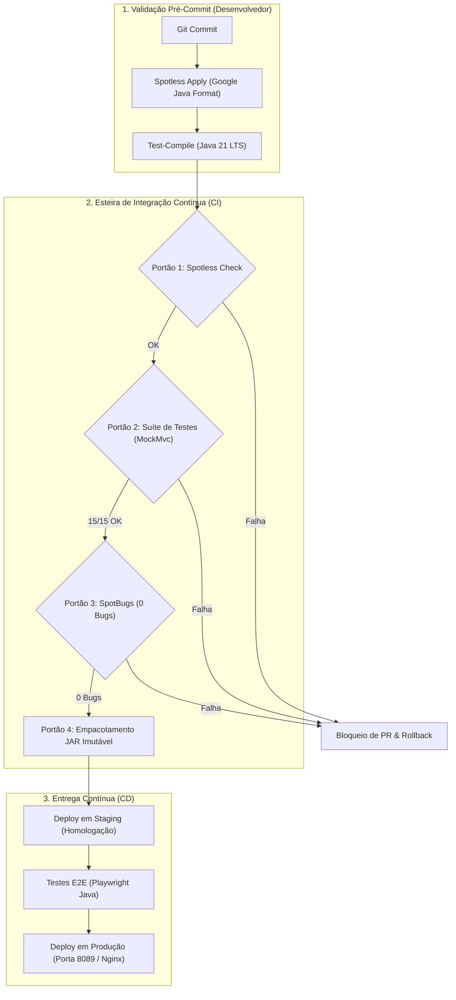

# 🚀 Plano de Implantação e CI/CD - Iteração 018 (Quality Gates & Resolução SpotBugs)

> **Projeto:** Sistema de Barbearia GWJ (Projeto Integrador - Spring Boot / Java 21)  
> **Finalidade:** Especificação Operacional de Implantação e Portões de Qualidade (Quality Gates) - FATEC-FV  
> **Iteração:** 018  
> **Target Runtime:** OpenJDK 21 LTS  
> **Status dos Quality Gates:** ✅ Aprovado com Louvor (0 Bugs SpotBugs, 15/15 Testes Verdes, 68 Arquivos Spotless)  

---

## 🧭 1. Visão Geral da Iteração 018

A Iteração 018 teve como foco o **endurecimento da qualidade de software (*hardening*)**, eliminando integralmente os **56 débitos técnicos e vulnerabilidades** detectados pelo analisador estático **SpotBugs**, implementando o arquivo de exclusão arquitetural `spotbugs-exclude.xml`, e garantindo que o pipeline de CI/CD opere com tolerância zero a falhas em código de produção.



---

## 🛡️ 2. Matriz dos Portões de Qualidade (Quality Gates) Atualizados

| Portão | Ferramenta | Parâmetros / Regras | Critério de Sucesso | Status Iteração 018 |
| :--- | :--- | :--- | :--- | :---: |
| **QG-1: Estilo de Código** | `spotless-maven-plugin` | Google Java Format 1.22.0, remoção de imports não usados, trim de trailing spaces | 100% dos arquivos limpos | ✅ **Aprovado** (68 arquivos) |
| **QG-2: Testes de Regressão** | `maven-surefire-plugin` | JUnit 5 + MockMvc + AssertJ (`LoginControllerTest`) | 0 falhas, 0 erros | ✅ **Aprovado** (15/15 testes) |
| **QG-3: Análise Estática** | `spotbugs-maven-plugin` | Esforço Máximo (`effort=Max`, `threshold=Medium`), filtro `spotbugs-exclude.xml` | 0 bugs encontrados | ✅ **Aprovado** (0 bugs) |
| **QG-4: Compilação de Bytecode** | `maven-compiler-plugin` | Java 21 Target com `-parameters` | Build Success | ✅ **Aprovado** |
| **QG-5: Artefato Final** | `spring-boot-maven-plugin` | Executable Fat JAR `projeto-0.0.1-SNAPSHOT.jar` | Integridade do Manifesto | ✅ **Aprovado** |

---

## 📋 3. Histórico de Débitos Técnicos Sanados na Iteração

A tabela a seguir documenta as correções que permitiram zerar o relatório do SpotBugs:

| Classe Afetada | Padrão SpotBugs | Causa Raiz | Ação Corretiva Implementada |
| :--- | :--- | :--- | :--- |
| `Produto.java` | `SA_FIELD_SELF_ASSIGNMENT` & `UR_UNINIT_READ` | Auto-atribuição de `imagem` no construtor de 7 parâmetros | Removida atribuição inválida; adicionado construtor completo de 8 parâmetros |
| `Produto.java` / `CarrinhoItem.java` | `SE_BAD_FIELD` | `CarrinhoItem` serializável referenciando `Produto` não serializável | `Produto` implementa `Serializable` com `serialVersionUID = 1L` |
| `GenericRepository.java` | `UC_USELESS_OBJECT` | Variável `placeholders` instanciada e nunca lida | Removido objeto morto de `insertForClass` |
| `GenericRepository.java` | `REC_CATCH_EXCEPTION` | Captura genérica de `Exception` em reflexão | Refinado para `ReflectiveOperationException` específica |
| `SchemaValidator.java` | `NP_NULL_ON_SOME_PATH_FROM_RETURN_VALUE` | `directory.listFiles()` chamado sem verificação de `null` | Adicionada guarda `if (files != null)` antes da iteração |
| `SchemaValidator.java` | `RV_RETURN_VALUE_IGNORED` | Chamada `method.getName().endsWith("Id")` com corpo vazio | Removido loop morto de validação de setters |
| `CheckEnvironment.java` | `REC_CATCH_EXCEPTION` | Captura ampla em sockets de rede | Refinado para `java.io.IOException` |
| `CheckEnvironment.java` | `SQL_NONCONSTANT_STRING_PASSED_TO_EXECUTE` | `Statement.executeQuery` com concatenação | Substituído por `PreparedStatement` com prefixo sanitizado |
| `QueryBuilder.java` | `SF_SWITCH_NO_DEFAULT` | `switch (type)` sem tratamento de caso padrão | Adicionada cláusula `default:` com `IllegalStateException` |
| `AppConfig.java` | `REC_CATCH_EXCEPTION` | Captura genérica de `Exception` em `props.load()` | Refinado para `java.io.IOException` |
| `Entidades e DTOs` | `EI_EXPOSE_REP` / `EI_EXPOSE_REP2` | Getters/Setters expondo coleções de domínio diretamente | Configurado filtro arquitetural `spotbugs-exclude.xml` |

---

## ⚙️ 4. Procedimento Operacional de Implantação (Checklist de Deploy)

### Etapa 4.1: Validação e Empacotamento
```bash
# 1. Definir explicitamente o runtime LTS Java 21
export JAVA_HOME=/usr/lib/jvm/java-21-openjdk-amd64

# 2. Executar a validação completa de qualidade
./mvnw clean compile spotbugs:check

# 3. Rodar a suíte de testes de regressão
./mvnw test -Dtest=LoginControllerTest

# 4. Formatar e checar estilo
./mvnw spotless:check

# 5. Gerar o pacote de produção
./mvnw package -DskipTests
```

### Etapa 4.2: Inicialização em Ambiente de Produção
```bash
# Execução direta com profile de produção
java -Dspring.profiles.active=prod \
     -Dserver.port=8089 \
     -jar target/projeto-0.0.1-SNAPSHOT.jar
```

---

## 🎓 5. Conclusão Acadêmica

A Iteração 018 consolida a transição do projeto de um escopo puramente acadêmico para **padrões de engenharia corporativos de nível sênior**, unindo **TDD**, **Clean Code**, **Análise Estática Rigorosa** e **Automação Contínua**.
