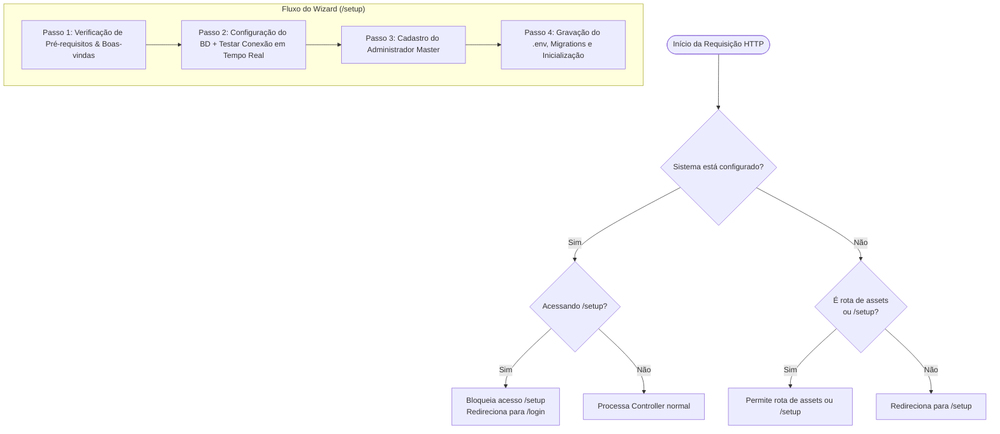

# DP-12: Plano de Implementação: Setup Wizard (Assistente de Instalação no Primeiro Boot)

- **Tipo:** Deployment plan
- **Status:** closed
- **Autor:** [Wattrelos](https://github.com/Wattrelos)
- **Criado em:** 2026-09-06 13:50:00
- **Labels:** Nenhuma
- **Responsáveis:** Nenhum

Implementar um assistente de instalação web interativo (*Setup Wizard*) para a primeira execução do sistema. Quando o aplicativo for iniciado sem um arquivo `.env` configurado ou sem tabelas/administrador no banco de dados, o usuário será automaticamente redirecionado para o fluxo guiado no navegador.

---

## Decisões de Arquitetura e Fluxo

### 1. Desacoplamento do Ciclo de Vida de Boot (Evitar que o Tomcat quebre no boot)
- **Problema atual:** No `StartApplication.java`, métodos de acesso a banco (`SchemaValidator.ensureUniqueEmailIndex()`, etc.) rodam antes de `SpringApplication.run()`. Se o banco não estiver configurado, a aplicação encerra com erro antes de subir o servidor HTTP.
- **Solução:** O `StartApplication` tentará verificar se o sistema já está configurado. Se o banco não estiver acessível ou o `.env` estiver ausente, ele não aborta a execução: deixa o Tomcat subir normalmente para servir o assistente. As validações de schema e tabelas serão disparadas durante o passo final do Wizard.

### 2. Trava de Segurança e Detecção de Estado (*Setup Lock*)
- Uma vez concluído o setup, a rota `/setup/**` é imediatamente **travada**. Ninguém poderá acessar `/setup` novamente para sobrescrever configurações ou recriar usuários sem permissão.
- Critério de sistema configurado (`isConfigured`):
  1. Arquivo `.env` existe no diretório raiz e possui valores válidos para `DB_URL` e `DB_USERNAME`.
  2. Conexão com o banco bem-sucedida.
  3. Tabela de usuários existe e contém pelo menos um usuário administrador cadastrado (`perfil_id = 1`).

---

## Mudanças Propostas

### Componente 1: Serviço de Setup e Estado (`SetupService.java`)
Criar o serviço responsável pelas operações de checagem, teste de conexão, criação física do `.env` e inicialização de tabelas e usuário administrador.

#### [NEW] [SetupService.java](/src/main/java/com/gwj/service/SetupService.java)
- `boolean isConfigured()`: Checa com cache em memória (ou verificação rápida) se o sistema já foi inicializado.
- `boolean testConnection(String host, int port, String dbName, String user, String password)`: Tenta conexão JDBC rápida (timeout de 3s).
- `void completeSetup(SetupDTO dto)`:
  - Cria o banco caso não exista (`CREATE DATABASE IF NOT EXISTS \`nome\``).
  - Escreve o arquivo `.env` físico no servidor com as variáveis informadas.
  - Recarrega `AppConfig.loadEnv()`.
  - Executa a criação das tabelas estruturais e permissões (executa scripts SQL base ou rotinas de `SchemaValidator`).
  - Cria o usuário Administrador Master com senha criptografada SHA-256 e perfil Administrador (`perfil_id = 1`).
  - Marca `isConfigured = true`.

---

### Componente 2: Interceptor e Segurança (`SetupInterceptor.java` e `WebConfig.java`)

#### [NEW] [SetupInterceptor.java](/src/main/java/com/gwj/controller/SetupInterceptor.java)
- Intercepta requisições HTTP:
  - Se `!setupService.isConfigured()` e a URL não for `/setup/**`, `/css/**`, `/js/**`, `/img/**`, `/favicon.ico` -> Redireciona para `/setup`.
  - Se `setupService.isConfigured()` e a URL for `/setup/**` -> Bloqueia e redireciona para a página de login administrativo `/MRYnZpAsC9sp/login` ou `/home`.

#### [MODIFY] [WebConfig.java](/src/main/java/com/gwj/controller/WebConfig.java)
- Registrar o `SetupInterceptor` com prioridade alta no `InterceptorRegistry`.

#### [MODIFY] [GlobalAttributesAdvice.java](/src/main/java/com/gwj/controller/GlobalAttributesAdvice.java)
- Adicionar proteção para não consultar a tabela de `Setting` caso a rota atual seja `/setup/**` ou o sistema não esteja configurado.

---

### Componente 3: Boot Resiliente (`StartApplication.java`)

#### [MODIFY] [StartApplication.java](/src/main/java/com/gwj/StartApplication.java)
- Executar `AppConfig.loadEnv()`.
- Colocar as chamadas de `SchemaValidator` em bloco tolerante a falhas (só executa se o banco responder; caso contrário, registra aviso amigável: *"Sistema não configurado. Acesse http://localhost:8089/setup para iniciar o assistente"*).

---

### Componente 4: Controller Web e API do Assistente (`SetupController.java`)

#### [NEW] [SetupController.java](/src/main/java/com/gwj/controller/SetupController.java)
- `GET /setup`: Renderiza a tela Thymeleaf do assistente com dados de pré-requisitos (versão Java, permissão de escrita).
- `POST /setup/test-db`: Endpoint AJAX para o botão "Testar Conexão", retornando `{ "success": true/false, "message": "..." }`.
- `POST /setup/finish`: Recebe os dados de banco e usuário administrador via formulário/JSON, executa a finalização e retorna sucesso.

---

### Componente 5: Interface Visual Moderna do Wizard (`wizard.html`)

#### [NEW] [wizard.html](/src/main/resources/templates/setup/wizard.html)
- Interface de alto padrão visual, consistente com o tema dark/glassmorphism e dourado da aplicação (`#e5c07b`, `#c5a880`).
- Navegação em passos (Tabs/Steps):
  1. **Passo 1: Boas-vindas**: Checagem de ambiente (Java 21, permissões de diretório).
  2. **Passo 2: Banco de Dados**: Host, Porta (padrão 3306), Nome do Banco (`gwj2`), Usuário (`desenvolvedor`), Senha do Banco, com botão **Testar Conexão** em tempo real com indicador de status animado.
  3. **Passo 3: Conta Administrador**: Nome Completo, E-mail e Senha (com confirmação e validação).
  4. **Passo 4: Instalação & Conclusão**: Barra de progresso animada ao aplicar as tabelas, finalizando com botão de ir para o Login.

---

## Plano de Verificação

### Testes Automatizados
- Executar `./mvnw test` para garantir que os testes unitários de serviços existentes continuam passando sem regressão.

### Testes Manuais de Fluxo
1. **Cenário de Primeira Instalação (Sem .env)**:
   - Renomear temporariamente `.env` para `.env.bak`.
   - Iniciar o servidor via `./mvnw spring-boot:run`.
   - Acessar `http://localhost:8089/` no navegador -> Deve redirecionar automaticamente para `http://localhost:8089/setup`.
   - No Passo 2, testar uma senha incorreta de banco -> Deve exibir alerta vermelho de erro.
   - Colocar a senha correta e clicar em "Testar Conexão" -> Deve exibir alerta verde de sucesso.
   - Preencher os dados do Administrador no Passo 3 e clicar em "Concluir Instalação".
   - Verificar se o arquivo `.env` foi gerado no disco com as credenciais corretas.
   - Verificar redirecionamento para o login e autenticar com o novo usuário criado.
2. **Cenário de Segurança Pós-Instalação**:
   - Tentar acessar manualmente `http://localhost:8089/setup` com o sistema configurado -> O acesso deve ser bloqueado e redirecionar para a tela inicial/login.
