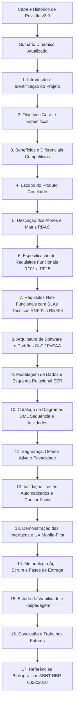

# Plano de Organização e Atualização do Documento Acadêmico (TCC / Projeto Integrador)

Este documento estabelece o plano detalhado para reorganizar, atualizar e enriquecer integralmente o documento principal de conclusão de curso:
[`trabalhos_conclusao_curso.md`](/apresentacao_trabalho_academico/trabalhos_conclusao_curso.md).

---

## Contexto e Diagnóstico Atual

O documento `trabalhos_conclusao_curso.md` encontrava-se na **Versão 1.3 (30/05/2026)**, refletindo o planejamento das fases iniciais do projeto. Desde então, o sistema evoluiu significativamente:
1. **Stack Real**: Migrou de um protótipo inicial (PHP/JSP/PostgreSQL hipotético) para uma aplicação robusta em **Java 21 LTS**, **Spring Boot 3.2.5**, **MySQL/MariaDB**, **Thymeleaf 3** e **Vanilla CSS/JS**.
2. **Engenharia de Software de Alto Nível**: Implementação de um motor dinâmico com **Zero-ORM overhead**, utilizando padrões clássicos GoF e PoEAA (*DataMapper*, *QueryBuilder*, *UnitOfWork* transacional com *ThreadLocal*, *SimpleObjectFactory*, *EntityMapper*, *ServiceRegistry*).
3. **Regras de Negócio e Agendamento Autônomo**: Motor de cálculo matemático de slots de 20 minutos com prevenção estrita de colisões e *double-booking*, trava de encerramento da barbearia e interface reativa com botões bloqueados/riscados.
4. **Segurança e RBAC**: Controle granular de permissões com `AdminInterceptor`, armadilha ativa para bots maliciosos (`HoneypotController`), senhas em SHA-256 e consultas 100% parametrizadas.
5. **Riqueza de Artefatos**: Produção de diagramas arquiteturais, diagramas conceituais/lógicos de banco (EER), diagramas de classes de domínio, 6 diagramas de sequência e 5 diagramas de atividades em PlantUML, SVG e PDF, além de suíte de testes unitários automatizados.
6. **Inconsistências no Documento Atual**: Requisitos com códigos duplicados (ex.: dois RF08, RF09 e RF10), ausência dos artefatos visuais implementados e falta das referências bibliográficas normatizadas pela ABNT.

---

## User Review Required

> [!IMPORTANT]
> **Preservação e Estrutura da Capa**: O documento possui uma capa inicial com a imagem em base64 (`[image1]`). Propomos manter a compatibilidade visual acadêmica, substituindo dados obsoletos de datas/versão por **Versão 2.0 - Projeto Concluído**, corrigindo a tabela de histórico de revisões e atualizando o sumário analítico com as novas seções.

> [!NOTE]
> **Integração dos Diagramas**: Incluiremos referências claras aos arquivos SVG e PlantUML localizados em `docs/`, permitindo aos avaliadores visualizar os fluxos no próprio markdown ou abri-los em alta resolução.

---

## Estrutura Proposta para o Documento Atualizado

O documento será reorganizado e expandido para manter conformidade com as diretrizes acadêmicas (Projeto Integrador e FETEPS/ABNT NBR 6023:2018), distribuído nas seguintes seções:

---

## Proposed Changes

### Componente de Documentação Acadêmica

#### [MODIFY] [`trabalhos_conclusao_curso.md`](/apresentacao_trabalho_academico/trabalhos_conclusao_curso.md)

1. **Revisão e Capa**:
   - Atualizar status para **Versão 2.0**, adicionando ao Histórico de Revisão as entregas de arquitetura dinâmica, motor de horários, segurança RBAC e suíte de testes.
   - Reconstruir o **Sumário** para refletir a nova numeração e as novas seções de arquitetura, diagramas e referências.

2. **Identificação e Objetivos**:
   - Atualizar a ficha técnica com a stack oficial: **Java 21 LTS**, **Spring Boot 3.2.5**, **MySQL 8.0 / MariaDB**, **Thymeleaf**, **HTML5/CSS3 Vanilla**, **Maven**.
   - Definir claramente o objetivo de entregar uma plataforma web de agendamento autônomo com controle de gestão e e-commerce de produtos masculinos.

3. **Diferenciais de Software (4 Pilares)**:
   - Transpor o conteúdo de [`docs/documentos_para_faculdade.md/diferencial de software.md`](/docs/documentos_para_faculdade.md/diferencial%20de%20software.md), contrastando a solução GWJ com SaaS fechados (Trinks, AppBarber) e WhatsApp manual:
     - Motor granular de 20 min com prevenção de colisões;
     - Ecossistema unificado (Agenda + Comandas + Loja/Estoque + RBAC);
     - Arquitetura de persistência própria com Zero-ORM overhead;
     - Soberania total dos dados e custo operacional fixo sem taxas por agendamento.

4. **Classificação do Sistema e Atores**:
   - Classificação refinada: SPT (Processamento Transacional de agendamentos e vendas), SIG (Relatórios operacionais e dashboards) e SIE (Visão executiva do proprietário).
   - Detalhamento dos atores (*Cliente*, *Profissional/Barbeiro*, *Recepcionista/Atendente*, *Administrador/Proprietário*) e seus direitos de acesso.

5. **Requisitos Funcionais (Consolidados e Sem Duplicações)**:
   - **RF01 – Cadastro e Gestão de Perfil de Clientes**: Formulário eletrônico, validação de unicidade de e-mail e edição cadastral.
   - **RF02 – Autenticação, Recuperação de Acesso e Gestão de Sessão**: Login com hash seguro, encerramento de sessão e recuperação.
   - **RF03 – Catálogo de Serviços, Preços e Kits Promocionais**: Vitrine de serviços e produtos masculinos.
   - **RF04 – Motor de Grade de Horários e Cálculo de Slots Granulares**: Algoritmo de discretização de agenda em blocos de 20 minutos (`AgendamentoService`).
   - **RF05 – Agendamento Online Autônomo e Prevenção de Conflitos**: Reserva direta pelo cliente, validação atômica de sobreposição de intervalos e prevenção de *double-booking*.
   - **RF06 – Cancelamento e Reagendamento de Serviços**: Gestão de horários com liberação automática de slots na agenda.
   - **RF07 – Painel Administrativo Genérico e Dinâmico**: CRUD unificado via reflexão para todas as entidades do sistema.
   - **RF08 – Gestão de Profissionais, Dias e Horários de Atendimento**: Parametrização da escala semanal e limites de expediente.
   - **RF09 – Controle de Acesso Baseado em Papéis e Permissões (RBAC)**: Matriz de permissões (`tab_perfil_permissao`) protegida por interceptores.
   - **RF10 – E-Commerce de Cosméticos Masculinos e Baixa de Estoque**: Venda de pomadas e óleos com controle atômico na tabela `tab_produto`.
   - **RF11 – Gestão de Comandas e Atendimento Presencial**: Apuração de serviços executados e produtos consumidos.
   - **RF12 – Módulo de Lembretes Automáticos e Notificações**: Rotina agendada para aviso prévio de horários marcados.
   - **RF13 – Pagamento e Confirmação de Agendamento**: Integração do checkout com confirmação em tempo real.
   - **RF14 – Histórico Financeiro e Relatórios Gerenciais**: Rastreamento de transações e métricas operacionais.
   - **RF15 – Armadilha de Segurança Cibernética (Honeypot)**: Interceptação e bloqueio de tentativas de invasão em rotas legadas (`/admin`).

6. **Requisitos Não-Funcionais com Métricas Técnicas**:
   - **RNF01 – Desempenho e Eficiência**: Tempo de resposta na listagem de horários disponíveis inferior a 1.2 segundos sob carga normal.
   - **RNF02 – Consistência Transacional e Concorrência ACID**: Prevenção absoluta de conflitos de reserva por meio de transações atômicas com `UnitOfWork` e isolamento por thread (`ThreadLocal`).
   - **RNF03 – Segurança e Proteção de Dados**: Imunidade a SQL Injection garantida por instruções parametrizadas (`PreparedStatement`), senhas em SHA-256 e controle RBAC.
   - **RNF04 – Usabilidade e Responsividade (Mobile-First)**: Interface em CSS Vanilla com design system contrastante (paleta escura e dourada), áreas de toque confortáveis (mínimo de 44x44px) e total adaptabilidade a celulares, tablets e desktops.
   - **RNF05 – Arquitetura Desacoplada e Manutenibilidade**: Separação estrita em camadas (Controller, Service, Repository, Mapper, Factory) em conformidade com os princípios SOLID e Clean Architecture.
   - **RNF06 – Resiliência e Disponibilidade Operacional**: Tratamento global de exceções via `@ControllerAdvice`, garantindo respostas amigáveis 404 e 500 sem exposição de *stacktraces*.

7. **Arquitetura de Software e Padrões GoF / PoEAA Aplicados**:
   - Inserir a descrição detalhada e o diagrama textual/visual da arquitetura proposta em [`docs/architecture/architecture_diagram.puml`](/docs/architecture/architecture_diagram.puml).
   - Explicar os 8 padrões implementados:
     * *Singleton* (`ConnectionDB`)
     * *Factory Method / Simple Factory* (`SimpleObjectFactory`)
     * *Data Mapper* (`DataMapper`)
     * *Query Builder* (`QueryBuilder`)
     * *Unit of Work* (`UnitOfWork`)
     * *DTO / Entity Mapper* (`EntityMapper`)
     * *Service Locator / Registry* (`ServiceRegistry`)
     * *Strategy / Interceptor* (`AdminInterceptor`, `GlobalExceptionHandler`)
     * *Decorator / Template View* (Thymeleaf layout)

8. **Modelagem de Dados e Esquema EER**:
   - Explicação do modelo relacional com cardinalidades, chaves primárias e estrangeiras.
   - Descrição das tabelas principais e associativas (`tab_profissional_endereco`, `tab_cliente_endereco`, `tab_perfil_permissao`, `tab_agenda_servico`).
   - Referência ao diagrama EER [`EER-diagram.puml`](/docs/architecture/EER-diagram.puml).

9. **Catálogo de Diagramas Técnicos do Projeto**:
   - Diagrama de Classes de Domínio ([`diagramasClassesDominio.puml`](/docs/diagramas/diagramasClassesDominio.puml))
   - Diagramas de Sequência:
     * Agendamento Online Autônomo ([`sequenceDiagramBooking.puml`](/docs/workflows/sequence/sequenceDiagramBooking.puml))
     * Gestão Dinâmica de Horários no Admin ([`sequenceDiagramAdminSchedule.puml`](/docs/workflows/sequence/sequenceDiagramAdminSchedule.puml))
     * Autenticação e Segurança ([`sequenceDiagramAuthSecurity.puml`](/docs/workflows/sequence/sequenceDiagramAuthSecurity.puml))
     * E-Commerce e Baixa de Estoque ([`sequenceDiagramEcommerce.puml`](/docs/workflows/sequence/sequenceDiagramEcommerce.puml))
     * Cancelamento e Reagendamento ([`sequenceDiagramCancelReschedule.puml`](/docs/workflows/sequence/sequenceDiagramCancelReschedule.puml))
     * Job de Lembretes Automáticos ([`sequenceDiagramNotificationJob.puml`](/docs/workflows/sequence/sequenceDiagramNotificationJob.puml))
   - Diagramas de Atividades:
     * Fluxo de Agendamento, Execução de Serviço, Cancelamento/Reagendamento, Compra de Produtos e Envio de Lembretes.

10. **Testes, Concorrência e Validação**:
    - Apresentar a metodologia de testes:
      * Testes unitários com JUnit 5 (`AgendamentoServiceTest` e `UsuarioServiceTest`).
      * Testes do cálculo de sobreposição matemática de slots.
      * Validação da regra de encerramento às 19:00 e bloqueio de slots passados.
      * Sucesso na compilação do Maven e execução de testes automatizados.

11. **Demonstração das Interfaces e UX**:
    - Detalhar o fluxo real da aplicação:
      * `home.html` (Landing Page com apresentação, localização e chamada para ação);
      * `servicos.html` (Seleção de serviços, escolha de barbeiro e slots interativos com estados *Disponível*, *Ocupado/Riscado* e *Selecionado*);
      * `checkout.html` e `confirmacao.html` (Resumo da reserva, identificação do cliente e instruções finais);
      * Painel Administrativo (`listagem-dinamica.html`, `create.html`, `edit.html`);
      * Páginas institucionais (`sobre-nos.html`, `contato.html`) e login com tratamento de erros.

12. **Estudo de Viabilidade e Hospedagem**:
    - Síntese da viabilidade técnica e financeira em nuvem (VPS Linux com Docker/Compose ou hospedagem compartilhada de baixo custo).

13. **Referências Bibliográficas (Normas ABNT NBR 6023:2018)**:
    - Incorporação de todas as referências clássicas (Fowler, Gamma et al., Martin, Bloch, Evans, Elmasri, Booch, Johnson, Walls, OWASP).

---

## Verification Plan

### Verificação do Documento
1. Conferir se todas as seções possuem numeração contínua e títulos coerentes.
2. Validar que não há links quebrados para os arquivos do projeto (`file://` para arquivos do repositório).
3. Verificar a ausência de códigos de requisitos duplicados (RF01 a RF15 exclusivos e ordenados).
4. Conferir a clareza e fidelidade técnica em relação ao código real em `src/main/java`.
5. Garantir que as normas ABNT NBR 6023:2018 estejam devidamente aplicadas na seção de referências.

---
