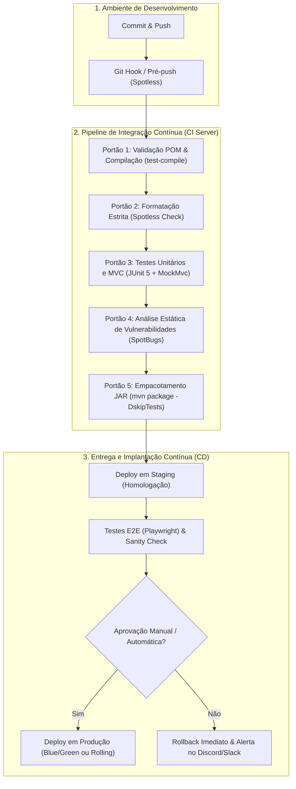

# 🚀 Plano de Implantação e CI/CD (Deploy Plan)

> **Projeto:** Sistema de Barbearia GWJ (Projeto Integrador - Spring Boot / Java 21)  
> **Finalidade:** Documento de Engenharia de Software e Simulação Profissional para Ambientes Corporativos e Acadêmicos (FATEC-FV)  
> **Versão da Aplicação:** `0.0.1-SNAPSHOT`  
> **Target Runtime:** OpenJDK 21 LTS  

---

## 🧭 1. Visão Geral da Arquitetura de Implantação

O objetivo deste plano é garantir que **nenhum código defeituoso atinja os ambientes de homologação ou produção**. O pipeline adota o conceito de **Portões de Qualidade (Quality Gates)** e **Ciclo Fechado com Feedback Determinístico**, conforme definido nos padrões de Engenharia de Software Moderna.



---

## 🛡️ 2. Portões de Qualidade (Quality Gates)

Cada commit ou Pull Request deve ser submetido à seguinte esteira estrita:

| Estágio | Ferramenta / Plugin | Critério de Aceitação | Ação em caso de Falha |
| :--- | :--- | :--- | :--- |
| **G1. Compilação** | `maven-compiler-plugin` (Java 21) | Zero erros de sintaxe e contratos | Abortar build imediatamente |
| **G2. Estilo e Linters** | `spotless-maven-plugin` (Google Java Format) | 100% dos arquivos em conformidade | Executar `./mvnw spotless:apply` |
| **G3. Testes Funcionais** | `maven-surefire-plugin` (JUnit 5 / MockMvc) | 0 falhas, 0 erros em `LoginControllerTest` e suítes | Bloquear merge de Pull Request |
| **G4. Análise Estática** | `spotbugs-maven-plugin` | 0 bugs de severidade Alta/Crítica | Abrir card de correção prioritária |
| **G5. Validação E2E** | Playwright Java | Telas de login e checkout responsivas | Reverter imagem Docker |

---

## 📋 3. Matriz de Ambientes

| Parâmetro | Desenvolvimento (Local) | Homologação (Staging) | Produção (Live) |
| :--- | :--- | :--- | :--- |
| **JDK** | OpenJDK 21 (Debian 13) | Eclipse Temurin 21 Container | Eclipse Temurin 21 Container |
| **Banco de Dados** | MariaDB Local / Postgres descartável | PostgreSQL Container | MariaDB/PostgreSQL Cluster |
| **Porta HTTP** | `8089` | `8080` | `80` / `443` (via Nginx Reverse Proxy) |
| **Perfil Spring** | `dev` | `staging` | `prod` |
| **MockMvc / Mocks** | Habilitados para testes ágeis | Testcontainers com dados sintetizados | Desabilitados |

---

## ⚙️ 4. Procedimento Operacional Passo a Passo (SOP)

### Etapa 4.1: Pré-Deploy (Validação Local pelo Desenvolvedor)
Antes de submeter o branch para revisão:
```bash
# 1. Definir explicitamente o runtime LTS Java 21
export JAVA_HOME=/usr/lib/jvm/java-21-openjdk-amd64

# 2. Formatar código automaticamente
./mvnw spotless:apply

# 3. Executar suíte de testes de autenticação e controllers
./mvnw test -Dtest=LoginControllerTest

# 4. Validar empacotamento completo
./mvnw clean package -DskipTests
```

### Etapa 4.2: Deploy em Homologação
```bash
# 1. Gerar o artefato imutável
mvn clean package -DskipTests

# 2. Iniciar aplicação apontando para perfil de staging
java -Dspring.profiles.active=staging -Dserver.port=8089 -jar target/projeto-0.0.1-SNAPSHOT.jar
```

### Etapa 4.3: Plano de Rollback (Contingência)
Caso ocorra regressão em produção:
1. O balanceador de carga Nginx redireciona o tráfego para a versão estável anterior (estratégia *Blue/Green*).
2. O banco de dados preserva compatibilidade retroativa (migrações com estratégia *expand and contract*).
3. A equipe é notificada com o log exato gerado pelo Spring Boot.

---

## 🎓 5. Relevância Acadêmica (Engenharia de Software)

> [!NOTE]
> Este plano ilustra como projetos acadêmicos e integradores (FATEC) conectam os fundamentos de **Qualidade de Software**, **Engenharia de Requisitos**, **Padrões de Projeto (GoF)** e **DevOps**, preparando o estudante para a dinâmica real de times ágeis de alta performance.
