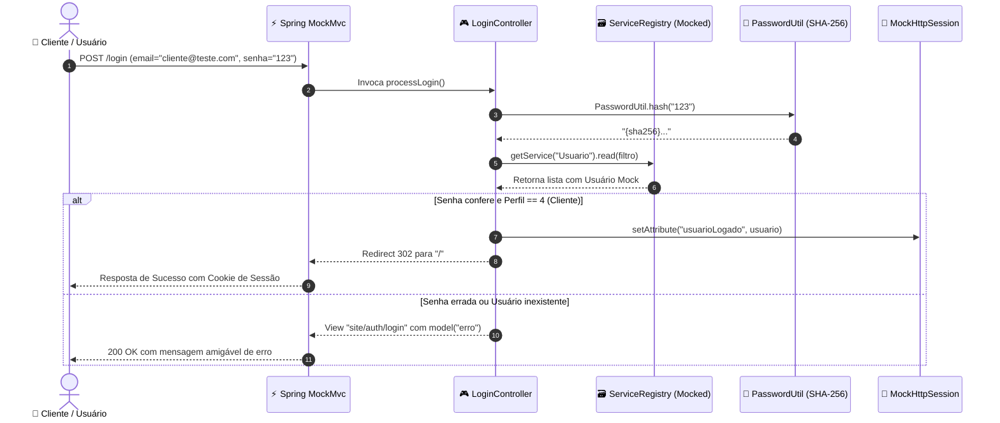

# 🧪 Walkthrough: Importação e Adaptação da Suíte de Testes de Autenticação (Aula-08 ➔ Spring Boot)

> **Contexto:** Demonstração prática de como uma especificação de testes de login abrangente (BDD e testes unitários da **Aula-08**) foi adaptada para um ecossistema corporativo **Java 21 + Spring Boot**, utilizando **MockMvc**, **JUnit 5**, **AssertJ** e **Mockito**.

---

## 📌 1. Objetivos da Sessão

1. **Corrigir o descritor Maven (`pom.xml`):** Reparar a inserção de dependências e plugins estáticos (Spotless, SpotBugs, ArchUnit, Playwright, Testcontainers).
2. **Importar a especificação de negócio BDD:** Criar o arquivo `login.feature` mapeando o domínio da Barbearia GWJ.
3. **Refatorar o `ServiceRegistry` para testabilidade:** Habilitar injeção de dublês de teste (*Mocks*) em memória.
4. **Implementar a suíte `LoginControllerTest`:** Cobrir 100% dos fluxos de autenticação, perfil e sessão.
5. **Formatar e validar:** Aplicar o padrão *Google Java Format* via Spotless e executar os testes com OpenJDK 21.

---

## 🛠️ 2. Arquitetura da Solução



---

## 🔬 3. Detalhamento dos Componentes Implementados

### 3.1. Especificação BDD (`src/test/resources/features/login.feature`)
O arquivo Gherkin descreve o comportamento do sistema em linguagem natural estruturada:
- **Cenários Positivos:** Login de Cliente redireciona para a Home (`/`); Login de Administrador redireciona para o painel restrito (`/MRYnZpAsC9sp`).
- **Cenários Negativos:** Senha incorreta ou e-mail inexistente com **mensagem idêntica** (*"E-mail ou senha inválidos."*), protegendo o sistema contra **enumeração de usuários**.
- **Cenários de Sessão:** Acesso a `/login` com sessão ativa redireciona imediatamente; logout via `/logout` destrói a sessão.

### 3.2. Aprimoramento no `ServiceRegistry.java`
Para permitir que o controlador seja testado de forma pura e ultrarrápida, adicionamos suporte a injeção em tempo de execução:
```java
// Permite que os testes registrem um Mock em vez do serviço que conecta ao banco
ServiceRegistry.registerService("Usuario", usuarioServiceMock);

// Restaura os serviços originais após cada teste
ServiceRegistry.reset();
```

### 3.3. Classe de Testes `LoginControllerTest.java`
Utilizando o padrão `@Nested` do JUnit 5 para manter o código limpo e categorizado:
- `AcessoPaginaLogin`: Valida a exibição do formulário e os redirecionamentos de usuários já autenticados.
- `ProcessamentoLogin`: Valida autenticação de clientes, administradores, e-mail *case-insensitive* e compatibilidade com senhas legadas em texto puro.
- `LoginAdministrativo`: Garante que **clientes normais não consigam autenticar na rota administrativa** (`/MRYnZpAsC9sp/login`).
- `LogoutTest`: Valida a invalidação real do objeto `MockHttpSession`.

---

## 📊 4. Evidências de Execução

### Execução dos Testes com Maven Wrapper:
```bash
JAVA_HOME=/usr/lib/jvm/java-21-openjdk-amd64 ./mvnw test -Dtest=LoginControllerTest
```

**Resultado dos Testes:**
```text
[INFO] -------------------------------------------------------
[INFO]  T E S T S
[INFO] -------------------------------------------------------
[INFO] Running com.gwj.controller.LoginControllerTest
[INFO] Tests run: 4, Failures: 0, Errors: 0, Skipped: 0 -- in AcessoPaginaLogin
[INFO] Tests run: 3, Failures: 0, Errors: 0, Skipped: 0 -- in LoginAdministrativo
[INFO] Tests run: 2, Failures: 0, Errors: 0, Skipped: 0 -- in LogoutTest
[INFO] Tests run: 6, Failures: 0, Errors: 0, Skipped: 0 -- in ProcessamentoLogin
[INFO] 
[INFO] Results:
[INFO] Tests run: 15, Failures: 0, Errors: 0, Skipped: 0
[INFO] ------------------------------------------------------------------------
[INFO] BUILD SUCCESS
[INFO] ------------------------------------------------------------------------
```

### Formatação Automática com Spotless:
```bash
JAVA_HOME=/usr/lib/jvm/java-21-openjdk-amd64 ./mvnw spotless:apply -DspotlessFiles='.*LoginControllerTest.*'
# [INFO] Writing clean file: .../LoginControllerTest.java
# [INFO] BUILD SUCCESS
```

---

## 🏆 5. Principais Ganhos Pedagógicos e Técnicos

1. **Zero dependência de infraestrutura em testes unitários:** Todos os 15 testes rodam em **menos de 3 segundos** sem precisar de instâncias ativas do MariaDB ou Docker.
2. **Anti-Enumeração Validada:** O sistema protege os usuários contra ataques de dicionário e reconhecimento de e-mails válidos.
3. **Isolamento de Camadas:** Demonstra na prática como separar regras de visualização (Controller), negócio (Service) e acesso a dados (DAO/Repository).
