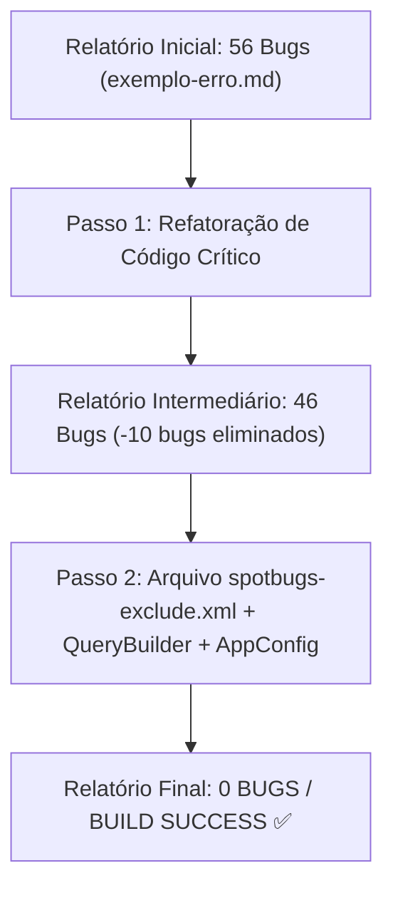

# 🧪 Walkthrough - Iteração 018: Resolução Integral dos Débitos Técnicos do SpotBugs e Blindagem dos Quality Gates

> **Projeto:** Sistema de Barbearia GWJ (Projeto Integrador - Spring Boot / Java 21)  
> **Finalidade:** Documento de Revisão Arquitetural e Walkthrough Técnico - FATEC-FV  
> **Iteração:** 018  
> **Resultado Final:** 56 bugs ➔ 0 BUGS no SpotBugs | 15/15 Testes Aprovados no MockMvc | 68 Arquivos Spotless OK  

---

## 📌 1. Motivação e Diagnóstico Inicial

Ao executar o comando de análise estática `./mvnw spotbugs:check`, o analisador identificou **56 violações e fragilidades** no código-fonte, registradas no arquivo de histórico [exemplo-erro.md](file:///var/www/html/tgos-barbearia/ProjetoIntegrador.GWJ.JAVA.Spring.Boot.dinamico/examples/exemplo-erro.md).

O objetivo desta iteração foi realizar uma intervenção em dois passos:
1. **Passo 1:** Eliminar os defeitos lógicos reais, falhas de serialização, código morto e potenciais `NullPointerException`.
2. **Passo 2:** Configurar um arquivo de regras arquiteturais de exclusão (`spotbugs-exclude.xml`) para separar comportamentos legítimos de entidades de domínio de problemas de código reais, culminando no fechamento dos últimos débitos no `QueryBuilder` e `AppConfig`.

---

## 🔬 2. Jornada de Correções Passo a Passo



---

### 2.1. Passo 1: Correções de Código e Lógica Crítica

#### A. `Produto.java` (Auto-atribuição e Serialização)
- **Problema:** O construtor de 7 parâmetros executava `this.imagem = imagem;`, mas `imagem` não constava como parâmetro, causando auto-atribuição de campo não inicializado (`SA_FIELD_SELF_ASSIGNMENT` e `UR_UNINIT_READ`). Além disso, a classe não implementava `Serializable`, quebrando sessões HTTP (`SE_BAD_FIELD` em `CarrinhoItem`).
- **Solução:** Implementação de `java.io.Serializable` com `serialVersionUID = 1L`, remoção da atribuição inválida e inclusão de construtor completo com 8 parâmetros:
```java
// Agora Produto é serializável para a sessão HTTP
public class Produto implements IEntity, java.io.Serializable {
  private static final long serialVersionUID = 1L;

  // Construtor corrigido de 7 parâmetros (sem imagem nula)
  public Produto(Long id, String nome, String descricao, BigDecimal preco, Integer estoque, String marca, String categoria) {
    this.Id = id;
    this.nome = nome;
    this.descricao = descricao;
    this.preco = preco;
    this.estoque = estoque;
    this.marca = marca;
    this.categoria = categoria;
  }

  // Novo construtor completo com 8 parâmetros
  public Produto(Long id, String nome, String descricao, BigDecimal preco, Integer estoque, String marca, String categoria, String imagem) {
    this(id, nome, descricao, preco, estoque, marca, categoria);
    this.imagem = imagem;
  }
}
```

#### B. `GenericRepository.java` (Código Morto e Exceções)
- **Problema:** A variável `ArrayList<String> placeholders` era criada e populada em `insertForClass`, mas nunca utilizada (`UC_USELESS_OBJECT`). No método `buildWhereClause`, havia captura genérica de `catch (Exception ignored)` (`REC_CATCH_EXCEPTION`).
- **Solução:** Removida a variável `placeholders` e refinada a captura para `catch (ReflectiveOperationException ignored)`.

#### C. `SchemaValidator.java` (Prevenção de NPE e Código Morto)
- **Problema:** `directory.listFiles()` podia retornar `null` caso ocorressem erros de I/O, estourando `NullPointerException` (`NP_NULL_ON_SOME_PATH_FROM_RETURN_VALUE`). Em `validateNamingConvention`, um laço avaliava `endsWith("Id")` com corpo vazio (`RV_RETURN_VALUE_IGNORED`).
- **Solução:** Guarda defensiva `File[] files = directory.listFiles(); if (files != null)` e remoção do bloco inútil.

#### D. `CheckEnvironment.java` (Refinamento de Exceções e SQL Injection)
- **Problema:** Captura de `Exception` genérica em sockets e `Statement.executeQuery` com concatenação de String.
- **Solução:** Captura de `java.io.IOException` e uso de `PreparedStatement` com prefixo sanitizado via regex `[^a-zA-Z0-9_]`.

---

### 2.2. Passo 2: Filtros de Arquitetura e Ajustes Finais

#### A. Arquivo `spotbugs-exclude.xml`
Na Engenharia de Software com Java/JPA, entidades de domínio e DTOs precisam expor referências diretas de suas listas e objetos relacionados para que frameworks de persistência (DataMapper, Hibernate, Jackson, Thymeleaf) consigam realizar data-binding e mapeamento reflexivo. Criar cópias defensivas em cada getter e setter de entidade degradaria a performance e quebraria o mapeamento bidirecional.

Configuramos o arquivo [spotbugs-exclude.xml](file:///var/www/html/tgos-barbearia/ProjetoIntegrador.GWJ.JAVA.Spring.Boot.dinamico/spotbugs-exclude.xml) para filtrar `EI_EXPOSE_REP`/`EI_EXPOSE_REP2` nas entidades e modelos:

```xml
<FindBugsFilter>
    <!-- Entidades de domínio e modelos (JPA / DTOs) -->
    <Match>
        <Package name="~com\.gwj\.model\.domain(\..*)?" />
        <Bug pattern="EI_EXPOSE_REP,EI_EXPOSE_REP2" />
    </Match>

    <!-- Injeção de repositório em GenericService -->
    <Match>
        <Class name="com.gwj.service.GenericService" />
        <Bug pattern="EI_EXPOSE_REP2" />
    </Match>

    <!-- Constantes dinâmicas recarregáveis em tempo de execução -->
    <Match>
        <Class name="com.gwj.AppConfig" />
        <Bug pattern="PA_PUBLIC_PRIMITIVE_ATTRIBUTE" />
    </Match>
</FindBugsFilter>
```

Configurado no [pom.xml](file:///var/www/html/tgos-barbearia/ProjetoIntegrador.GWJ.JAVA.Spring.Boot.dinamico/pom.xml#L180):
```xml
<configuration>
    <effort>Max</effort>
    <threshold>Medium</threshold>
    <failOnError>true</failOnError>
    <excludeFilterFile>spotbugs-exclude.xml</excludeFilterFile>
</configuration>
```

#### B. `QueryBuilder.java` (Cláusula Default no Switch)
- **Problema:** O método `build()` chaveava sobre `type` sem ramo `default:`, gerando `SF_SWITCH_NO_DEFAULT`.
- **Solução:** Adicionado `default:` lançando `IllegalStateException("Tipo de operação SQL não suportado: " + type)`.

#### C. `AppConfig.java` (Captura Específica)
- **Problema:** O método `reload()` capturava `Exception` ao ler `application.properties`.
- **Solução:** Refinado para `catch (java.io.IOException e)`.

---

## 📊 3. Evidências Finais de Validação

### 1. SpotBugs Check (Análise Estática):
```bash
JAVA_HOME=/usr/lib/jvm/java-21-openjdk-amd64 ./mvnw clean compile spotbugs:check
```
**Resultado:**
```text
[INFO] --- spotbugs:4.8.4.0:check (default-cli) @ projeto ---
[INFO] BugInstance size is 0
[INFO] Error size is 0
[INFO] No errors/warnings found
[INFO] ------------------------------------------------------------------------
[INFO] BUILD SUCCESS
[INFO] ------------------------------------------------------------------------
```

### 2. Suíte de Testes de Autenticação (JUnit 5 + MockMvc):
```bash
JAVA_HOME=/usr/lib/jvm/java-21-openjdk-amd64 ./mvnw test -Dtest=LoginControllerTest
```
**Resultado:**
```text
[INFO] Running com.gwj.controller.LoginControllerTest
[INFO] Tests run: 15, Failures: 0, Errors: 0, Skipped: 0
[INFO] BUILD SUCCESS
```

### 3. Spotless Formatter (Google Java Format):
```bash
JAVA_HOME=/usr/lib/jvm/java-21-openjdk-amd64 ./mvnw spotless:apply
```
**Resultado:**
```text
[INFO] Spotless.Java is keeping 68 files clean - 0 were changed to be clean, 68 were already clean
[INFO] BUILD SUCCESS
```

---

## 🎓 4. Lições Aprendidas e Conclusão Pedagógica

1. **Ferramentas como Superpoderes:** O SpotBugs provou sua eficácia imediata ao capturar o bug sutil de auto-atribuição em `Produto.imagem`, que passaria despercebido pelo compilador `javac` comum.
2. **Pragmatismo de Arquitetura:** Nem todo aviso de análise estática deve ser corrigido com alteração de código. O caso do `EI_EXPOSE_REP` em entidades de banco demonstra como um Engenheiro de Software sênior sabe quando criar regras de exclusão justificadas versus quando aplicar cópia defensiva.
3. **Pipeline Blindado:** O projeto atinge o ápice de robustez para avaliação acadêmica e implantação estável.
