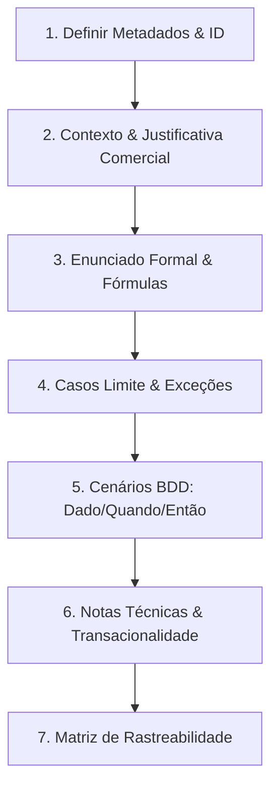

# 📘 Guia de Engenharia: Elaboração e Preenchimento de Regras de Negócio (RN)

Este documento estabelece o padrão oficial de engenharia de software para especificação, documentação e manutenção de **Regras de Negócio (RN)** no projeto **Sistema GWJ (Tgo's Barbearia)**. O modelo adota a cultura de **Docs as Code**, alinhando princípios de **Domain-Driven Design (DDD)**, **Behavior-Driven Development (BDD / Gherkin)** e normas do **BABOK (Business Analysis Body of Knowledge)**.

---

## 🎯 1. O que é uma Regra de Negócio?

Segundo o *Business Rules Group*, uma **Regra de Negócio** é uma declaração formal que define ou restringe algum aspecto do negócio. Ela representa o conhecimento corporativo puro, independente de interface gráfica, banco de dados ou tecnologia específica.

### ⚖️ Diferença entre Conceitos de Engenharia de Requisitos:

| Conceito | Pergunta que Responde | Exemplo no Sistema GWJ | Onde Documentar |
| :--- | :--- | :--- | :--- |
| **História de Usuário (US)** | *Quem quer, o que quer e para qual valor?* | "Como cliente, quero agendar um horário para cortar o cabelo no sábado." | `/docs/UserStory/` |
| **Requisito Funcional (RF)** | *O que o software deve fazer/oferecer?* | "O sistema deve disponibilizar um calendário com slots de horários vagos." | `/docs/requirements/functional/` |
| **Caso de Uso (UC)** | *Como ocorre o diálogo entre ator e sistema?* | Passo a passo de checkout do agendamento (`UC_STR_005`). | `/docs/business/use-cases/` |
| **Regra de Negócio (RN)** | *Qual é a restrição ou cálculo mandatório do domínio?* | "Um serviço de 40 min consome obrigatoriamente 2 blocos consecutivos de 20 min." | `/docs/requirements/business_rules/` |
| **Requisito Não-Funcional (RNF)** | *Com qual critério de qualidade ou restrição técnica?* | "O cálculo de disponibilidade deve responder em menos de 1.2 segundos." | `/docs/requirements/non_functional/` |

> [!TIP]
> **A Regra de Negócio existiria sem o software?**  
> Se a barbearia funcionasse em um caderno de papel, a regra continuaria existindo? Se a resposta for **sim** (ex: horários de encerramento, tolerância de atraso, travas de estoque, comissão de barbeiros), trata-se de uma **Regra de Negócio**. Se existisse apenas por conveniência da tela (ex: "o botão deve ser azul"), é apenas um detalhe de interface.

---

## 💎 2. Princípios e Boas Práticas de Redação

Ao redigir uma Regra de Negócio, siga impreterivelmente as seguintes diretrizes:

1. **Linguagem Ubíqua (Domain-Driven Design):**
   * Utilize rigorosamente os termos do [`docs/business/glossary.md`](file:///var/www/html/tgos-barbearia/ProjetoIntegrador.GWJ.JAVA.Spring.Boot.dinamico/docs/business/glossary.md).
   * Diga *"Slot de Horário"*, *"Double-Booking"*, *"Comanda"*, *"Kit Promocional"*, e nunca jargões genéricos desprovidos de contexto.
2. **Atomicidade e Coesão:**
   * Cada regra deve tratar de **uma única lógica ou restrição**.
   * Não misture validação de estoque com cálculo de frete ou permissão de acesso no mesmo identificador.
3. **Independência de Interface e Framework:**
   * Evite referenciar elementos de tela (*"o usuário clica no botão verde"* ou *"o modal fecha"*).
   * Descreva estados lógicos: *"Se o saldo for menor que a quantidade comprada, a transação é rejeitada."*
4. **Declarativa e Inequívoca:**
   * Evite ambiguidades como *"o sistema deve responder rápido"* ou *"quando possível"*.
   * Use termos determinísticos: *"deve"*, *"não deve"*, *"é obrigatório"*, *"é vedado"*.
5. **Critérios de Teste em Formato Gherkin (BDD):**
   * Toda regra deve ser acompanhada de cenários no formato `Dado / Quando / Então`, viabilizando a automação de testes de unidade e integração (JUnit / Cucumber).
6. **Rastreabilidade Bidirecional:**
   * Cada RN deve apontar para o Requisito Funcional pai, os Casos de Uso impactados e as classes de serviço correspondentes no código-fonte.

---

## 🏷️ 3. Padronização de Identificadores (Prefixos do Projeto)

Para assegurar consistência em todo o repositório, os identificadores de regras de negócio devem seguir a sintaxe:

$$\mathbf{RN\text{-}[MÓDULO]\text{-}[SEQUENCIAL]}$$

| Prefixo | Domínio de Aplicação | Arquivo de Consolidação |
| :--- | :--- | :--- |
| **`RN-AGE`** | Agendamento de Horários, Grade Base de 20 min, Vagas e Disponibilidade | [`regras_negocio_agendamento.md`](file:///var/www/html/tgos-barbearia/ProjetoIntegrador.GWJ.JAVA.Spring.Boot.dinamico/docs/business/regras_negocio_agendamento.md) |
| **`RN-EST`** | Loja Virtual, E-Commerce, Estoque e Kits Promocionais | [`regras_negocio_loja_estoque.md`](file:///var/www/html/tgos-barbearia/ProjetoIntegrador.GWJ.JAVA.Spring.Boot.dinamico/docs/business/regras_negocio_loja_estoque.md) |
| **`RN-SEG`** | Autenticação, Criptografia de Senhas, Permissões e RBAC | [`regras_negocio_seguranca_perfis.md`](file:///var/www/html/tgos-barbearia/ProjetoIntegrador.GWJ.JAVA.Spring.Boot.dinamico/docs/business/regras_negocio_seguranca_perfis.md) |
| **`RN-ATE`** | Atendimento Presencial, Check-in, Comandas e Comissões | [`regras_negocio_atendimento_comandas.md`](file:///var/www/html/tgos-barbearia/ProjetoIntegrador.GWJ.JAVA.Spring.Boot.dinamico/docs/business/regras_negocio_atendimento_comandas.md) |
| **`RN-CAN`** | Cancelamentos, Tolerâncias e Reagendamento de Horários | [`regras_negocio_cancelamento_reagendamento.md`](file:///var/www/html/tgos-barbearia/ProjetoIntegrador.GWJ.JAVA.Spring.Boot.dinamico/docs/business/regras_negocio_cancelamento_reagendamento.md) |
| **`RN-FIN`** | Faturamento, Métodos de Pagamento e Rateio Financeiro | `/docs/business/` |

---

## 🛠️ 4. Tutorial Passo a Passo: Como Preencher uma Regra de Negócio

Siga as 7 etapas abaixo ao conceber uma nova regra:



### **Passo 1: Tabela de Metadados**
Identifique formalmente a regra com identificador único, título claro, status de ciclo de vida (`🟢 Ativo`, `🟡 Em Revisão`, `🔴 Obsoleto`), versão semântica, autor e data.

### **Passo 2: Descrição Comercial (O Quê e Por Quê)**
Explique o racional de negócio em linguagem clara para stakeholders não-técnicos:
* Qual problema de negócio essa regra resolve?
* Qual impacto financeiro, operacional ou de segurança ela protege?

### **Passo 3: Enunciado Formal e Especificação Matemática**
Descreva a regra de maneira imperativa. Caso envolva cálculos, utilize fórmulas matemáticas em formato LaTeX e tabelas de decisão quando houver faixas ou matrizes de transição.

### **Passo 4: Escopo e Definições de Borda**
Delimite claramente onde a regra atua e onde ela **não** atua. Documente as condições de contorno (ex: limites mínimos, valores nulos, dias sem expediente, arredondamentos monetários).

### **Passo 5: Cenários de Teste em Gherkin (BDD)**
Escreva no mínimo 2 cenários concretos:
1. **Cenário de Caminho Feliz:** Comportamento quando a regra é satisfeita.
2. **Cenário de Violação / Bloqueio:** Comportamento quando a regra é violada e o sistema deve rejeitar a operação com mensagem amigável.
3. **Cenário Limite (Boundary Case):** Comportamento exatamente no limite do valor aceito.

### **Passo 6: Notas Técnicas e Restrições de Engenharia**
Orientações para o time de desenvolvimento backend/banco de dados:
* Necessidade de transação ACID via `UnitOfWork`?
* Padrão de hash ou criptografia exigido?
* Estratégia de bloqueio concorrente (*Pessimistic Locking* ou *Optimistic Locking*)?
* Nível de log ou auditoria requerido?

### **Passo 7: Rastreabilidade**
Vincule a regra aos artefatos do repositório:
* Requisito Funcional (`docs/requirements/functional/RFxxx.md`)
* Casos de Uso (`docs/business/use-cases/dashboard/` ou `storefront/`)
* Classes Java e Serviços (`src/main/java/com/gwj/...`)
* Tabelas do Banco de Dados (`tab_...`)

---

## 🌟 5. Exemplo Prático Aplicado: Domínio Barbearia GWJ

Veja abaixo um exemplo real e completo preenchido conforme as diretrizes deste guia:

```markdown
# RN-AGE-01: Ocupação de Múltiplos Blocos Consecutivos por Duração de Serviço

## 📋 Metadados

| Atributo | Detalhe |
| :--- | :--- |
| **Identificador** | `RN-AGE-01` |
| **Módulo** | Agendamento & Grade de Horários |
| **Status** | 🟢 Ativo |
| **Versão** | 1.1.0 |
| **Criticidade** | Alta |
| **Última Atualização** | 17/09/2026 |

---

## 1. 🎯 Descrição Comercial (O Quê e Por Quê)
A barbearia opera com uma grade de horários fracionada em blocos elementares de **20 minutos**. Como procedimentos diferentes possuem tempos de execução distintos (ex: corte simples dura 20 min, barboterapia dura 40 min e combos duram 60 min), o sistema deve alocar uma sequência contínua e ininterrupta de blocos livres na agenda do profissional para garantir que o cliente seja atendido do início ao fim sem interrupções e sem sobrepor atendimentos subsequentes.

---

## 2. 📜 Enunciado Formal e Cálculo de Blocos

A quantidade de blocos elementares necessários para um agendamento é calculada pela fórmula do teto da divisão:

$$\text{Blocos Necessários} = \left\lceil \frac{\text{tab\_servico.duracao}}{20} \right\rceil$$

### Regra de Disponibilidade de Horário:
Um horário inicial $H$ só pode ser classificado e exibido como **Disponível** na grade pública do profissional se e somente se:
1. O bloco inicial $H$ estiver com status livre;
2. Todos os blocos intermediários $H + (n \times 20\text{ min})$ até a duração total estiverem simultaneamente livres na agenda do profissional;
3. O horário de término previsto $H + \text{duracao}$ não ultrapassar o fechamento do expediente do dia (`RN-AGE-02`).

Se existir qualquer compromisso com status `'Confirmado'` em qualquer bloco da janela, o horário inicial $H$ deve ser sumariamente marcado como **Indisponível**.

---

## 3. 🧪 Cenários de Teste / Comportamento do Sistema (BDD / Gherkin)

### Cenário 1: Serviço de 40 minutos com blocos consecutivos livres
  Dado que o serviço "Barba Terapia" possui duração de 40 minutos (2 blocos de 20 min)
  E o profissional "Carlos" está livre às 10:00 e às 10:20
  Quando o motor de agendamento calcula os horários disponíveis para o dia
  Então o horário "10:00" deve figurar como DISPONÍVEL na grade pública

### Cenário 2: Serviço de 40 minutos com colisão em bloco intermediário
  Dado que o serviço "Barba Terapia" possui duração de 40 minutos (2 blocos de 20 min)
  E o profissional "Carlos" está livre às 14:00
  Mas já possui um atendimento confirmado às 14:20
  Quando o motor de agendamento calcula os horários disponíveis para o dia
  Então o horário "14:00" deve figurar como INDISPONÍVEL na grade pública

---

## 4. ⚙️ Notas Técnicas e Arquitetura

* **Camada de Execução:** Método `getHorariosDisponiveis` em `AgendamentoService.java`.
* **Desempenho:** O algoritmo deve iterar sobre a lista de blocos pré-carregados em memória para não disparar consultas SQL repetitivas (N+1) no banco de dados.
* **Consistência:** A confirmação final da reserva deve ocorrer sob trava transacional (`RN-AGE-05`) via `UnitOfWork`.

---

## 5. 🔗 Rastreabilidade

* **Requisito Funcional:** [`RF002_grade_horarios_disponibilidade.md`](/docs/requirements/functional/RF002_grade_horarios_disponibilidade.md)
* **Casos de Uso Afetados:** [`UC_STR_004`](/docs/business/use-cases/storefront/UC_STR_004_catalogo_servicos_e_disponibilidade.md), [`UC_ADM_005`](/docs/business/use-cases/dashboard/UC_ADM_005_gerenciar_agendamentos.md)
* **Classes Relacionadas:** `AgendamentoService.java`, `Servico.java`, `GradeHorarios.java`
* **Tabelas do Banco:** `tab_agendamento`, `tab_servico`, `tab_grade_horarios`
```

---

## 📋 6. Template Oficial para Novas Regras (Copie e Cole)

Utilize o modelo Markdown abaixo para cadastrar uma nova Regra de Negócio:

````markdown
# [ID DA REGRA]: [Título Conciso e Declarativo da Regra]

## 📋 Metadados

| Atributo | Detalhe |
| :--- | :--- |
| **Identificador** | `RN-[MÓDULO]-[SEQUENCIAL]` |
| **Módulo** | [Nome do Módulo do Domínio] |
| **Status** | 🟢 Ativo / 🟡 Em Revisão / 🔴 Obsoleto |
| **Versão** | 1.0.0 |
| **Criticidade** | Baixa / Média / Alta / Crítica |
| **Autor** | [Nome do Autor / Engenheiro de Requisitos] |
| **Data de Criação** | [DD/MM/AAAA] |
| **Última Atualização** | [DD/MM/AAAA] |

---

## 1. 🎯 Descrição Comercial (O Quê e Por Quê)
[Explique em 1 a 2 parágrafos o objetivo comercial ou operacional desta regra e o risco evitado ao aplicá-la.]

---

## 2. 📜 Enunciado Formal e Especificações

[Descreva de forma determinística e imperativa o que o sistema deve validar, permitir ou bloquear.]

### Fórmulas ou Matriz de Decisão (quando aplicável):
[Insira tabelas de faixas, fórmulas em LaTeX ou regras de cálculo financeiro/temporal.]

---

## 3. ⚖️ Escopo e Condições de Borda

* **Aplica-se a:** [Entidades, perfis ou canais abrangidos pela regra.]
* **Não se aplica a:** [Exceções explícitas onde a regra não tem validade.]
* **Condição de Contorno:** [Comportamento em valores nulos, zerados ou datas limites.]

---

## 4. 🧪 Cenários de Teste / BDD (Gherkin)

### Cenário 1: [Nome do Cenário de Sucesso / Caminho Feliz]
  Dado [contexto inicial pré-existente]
  Quando [ação executada pelo usuário ou sistema]
  Então [resultado esperado que confirma a aderência à regra]

### Cenário 2: [Nome do Cenário de Violação / Exceção]
  Dado [contexto em que a regra será violada]
  Quando [tentativa de execução da operação]
  Então [bloqueio mandatório do sistema com mensagem de erro amigável]

---

## 5. ⚙️ Notas Técnicas e Impacto na Arquitetura

* **Transacionalidade:** [Ex: Requer transação ACID única via UnitOfWork? Requer rollback automático?]
* **Segurança / Criptografia:** [Ex: Exige hashing SHA-256 com prefixo {sha256}?]
* **Tratamento de Exceções:** [Ex: Qual classe de Exception deve ser lançada em caso de violação?]
* **Logs e Auditoria:** [Ex: Deve gerar log de auditoria com dados do usuário?]

---

## 6. 🔗 Matriz de Rastreabilidade

* **Requisito Funcional (RF):** [`RFxxx_...`](/docs/requirements/functional/...)
* **Casos de Uso Afetados:** [`UC_...`](/docs/business/use-cases/...)
* **Classes de Implementação:** [`ExemploService.java`](/src/main/java/com/gwj/service/...)
* **Tabelas do Banco de Dados:** `tab_exemplo`
````

---

## ✅ 7. Checklist de Qualidade (Definition of Ready / Done)

Antes de considerar uma Regra de Negócio aprovada e pronta para desenvolvimento, valide se todos os itens abaixo estão atendidos:

- [ ] O identificador segue o padrão oficial (`RN-[MÓDULO]-[ID]`).
- [ ] O texto utiliza a Linguagem Ubíqua do glossário oficial do projeto.
- [ ] A descrição é declarativa e independente de componentes visuais da interface (sem mencionar botões ou cores).
- [ ] A regra é atômica (trata de uma única restrição ou cálculo).
- [ ] Contém pelo menos dois cenários de teste escritos em formato Gherkin (`Dado / Quando / Então`).
- [ ] Informa o tratamento de exceção amigável para o usuário em caso de violação.
- [ ] Aponta as notas de arquitetura e transacionalidade (ACID, Rollback, Lock).
- [ ] Possui rastreabilidade cruzada preenchida com links para os RFs, Casos de Uso e classes Java.
